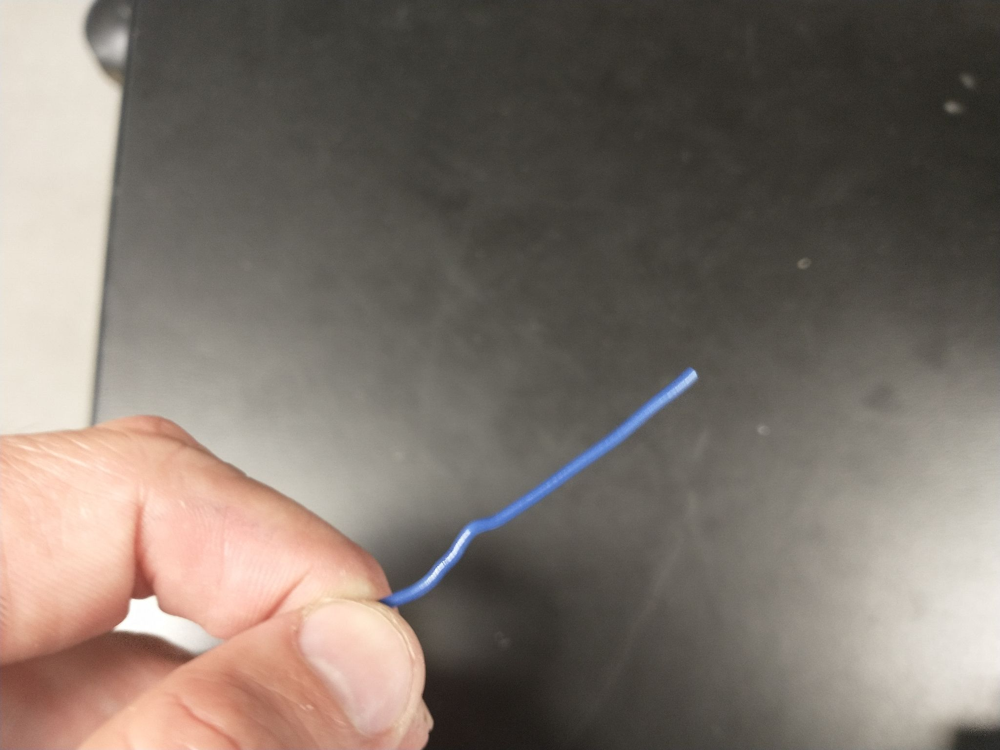
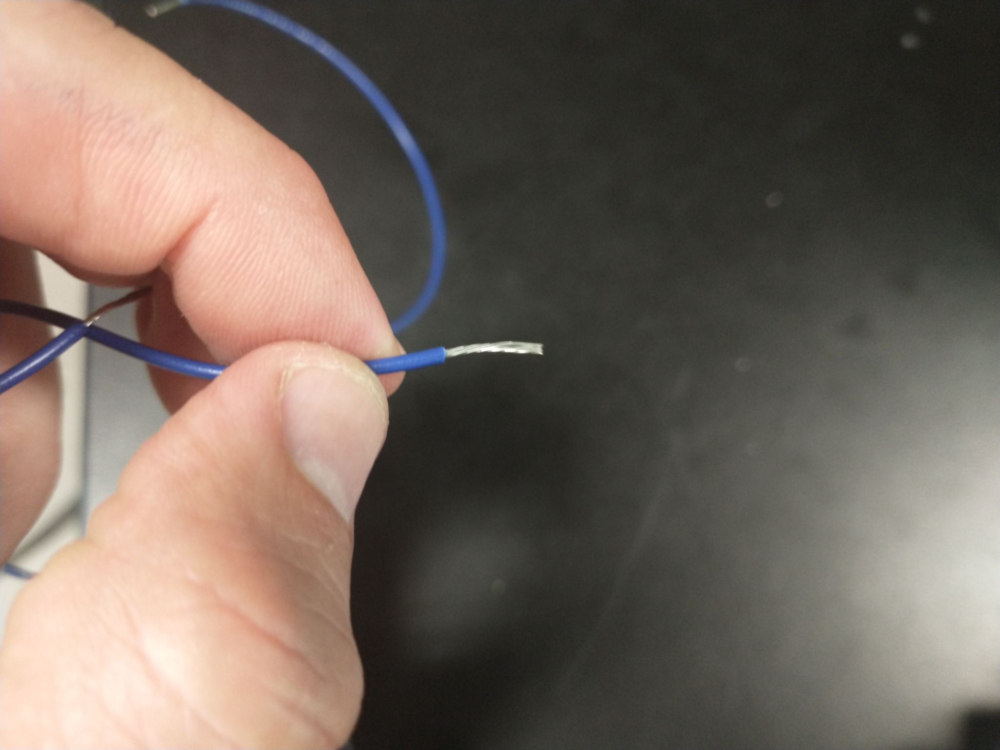
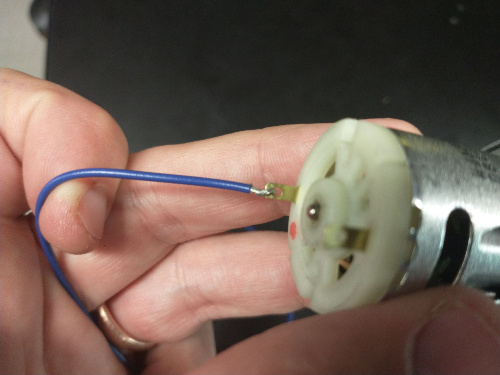
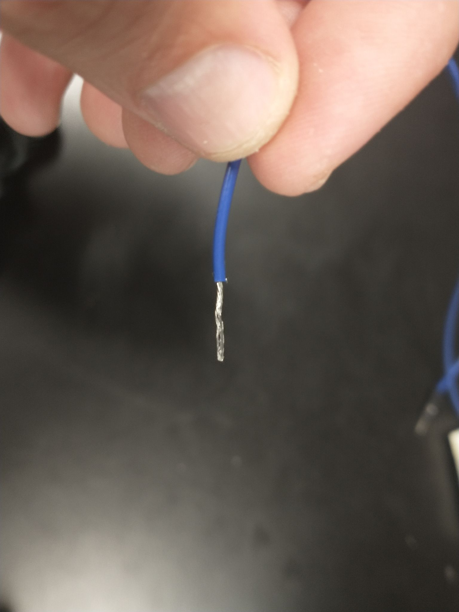
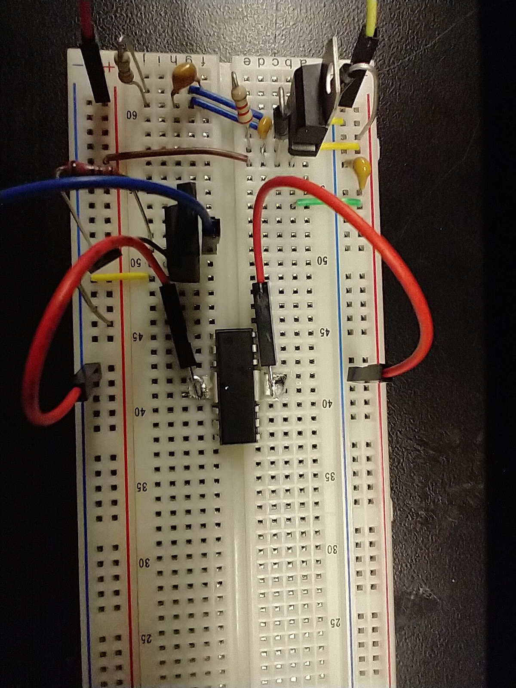
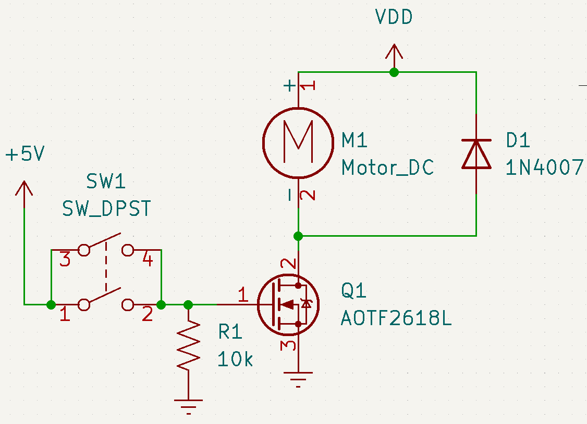

> This assignment is a ***paired in-class checkoff***. An **individual** live demonstration is required. You may work in pairs (**one** partner), but must individually demonstrate your working breadboard.

## Objectives

The goal for this in-class checkoff is to learn how to use transistors as switches for the purposes of driving high-current actuators and other "outputs". You will gain practice at designing basic switching circuits utilizing metal-oxide semiconductor field effect transistors (MOSFETs) and bidirectional switching circuits using an H-Bridge.

> This in-class checkoff requires advance work in order to complete it within one class period. Please read through the ICC, read all datasheets and prepare your circuits as much as possible.

## Resources

* Videos
    * [Overview Video](https://www.youtube.com/watch?v=2h4-ymfWU7I) (Thanks Saikat!)
    * [Example](https://www.youtube.com/watch?time_continue=1&v=I_0KiCHUrXg&feature=emb_logo) of checking off Part 1
    * [Example](https://www.youtube.com/watch?v=JdKzn-xicGc&feature=emb_logo) of checking off Part 2
* Scherz & Monk
    * Section 4.2 Diodes
        * 4.2.5 Diode Applications
    * Section 4.3: Transistors
        * 4.3.1 - Introduction
        * 4.3.4 - MOSFETs
    * Chapter 11: Voltage Regulators and Power Supplies
* [BK Precision Triple-Output 30V, 5A Digital Display DC Power Supply (Model 1671)](https://www.bkprecision.com/products/power-supplies/1671A) ([manual](https://bkpmedia.s3.amazonaws.com/downloads/manuals/en-us/1671A_manual.pdf))
* [Agilent Digital Multimeter (Model 34461A)](https://www.keysight.com/us/en/support/34461A/digital-multimeter-6-5-digit-truevolt-dmm.html) ([manual](https://www.dropbox.com/s/futmq59a8ftekqs/Agilent_DMM_34461A.pdf?dl=0))
* Canvas discussion board
* The Embedded Systems Design [website](https://embedded-systems-design.github.io)
* [MOSFET as a Switch](https://www.electronics-tutorials.ws/transistor/tran_7.html) from ElectronicsTutorials

## Parts Needed

| **Item**                    | **Quantity** | **Detail**                                                                                                                                                                                                |
| --------------------------- | ------------ | --------------------------------------------------------------------------------------------------------------------------------------------------------------------------------------------------------- |
| 5V Power Supply             | 1            | from In-Class Checkoff #1                                                                                                                                                                                 |
| AOTF2618L MOSFET            | 1            | ([digikey](https://www.digikey.com/product-detail/en/alpha-omega-semiconductor-inc/AOTF2618L/785-1442-5-ND/3603382)) ([datasheet](http://aosmd.com/res/data_sheets/AOTF2618L.pdf))                        |
| FAN8100N H-Bridge           | 1            | ([digikey](https://www.digikey.com/en/products/detail/fairchild-semiconductor/FAN8100N/11558200)) ([datasheet](https://rocelec.widen.net/view/pdf/1pizbjqffm/FAIRS23777-1.pdf?t.download=true&u=5oefqw))  |
| Gear Motor                  | 1            | ([datasheet](https://web.archive.org/web/20230923052123/https://www.allelectronics.com/mas_assets/media/allelectronics2018/spec/DCM-416.pdf)) supplied in class, 1 per station **(do not take with you)** |
| 1/4 Watt Resistors          | 3            | 10 k$\Omega$, handed out previously                                                                                                                                                                       |
| Pushbutton Switches         | 3            | handed out previously                                                                                                                                                                                     |
| 1N4007 Diode                | 1            | handed out in class / previously                                                                                                                                                                          |
| Benchtop Power Supply       | 1            | at lab stations                                                                                                                                                                                           |
| 9V, 3A Plug-in Power Supply | 1            | handed out in class / previously ([amazon link](https://www.amazon.com/gp/product/B09ZTKTLGW/))                                                                                                                                                                         |
| Benchtop Multimeter         | 1            | at lab stations                                                                                                                                                                                           |
| Capacitors                  | 2            | 0.1 µF (104), handed out previously                                                                                                                                                                       |

<!-- | Gear Motor (variant 2) | 1            | ([mpja](https://www.mpja.com/12VDC-500-RPM-Gearhead-Motor/productinfo/35500+MD/)) supplied in class, 1 per station **(do not take with you)**                                                             |  -->

## Prior to Verification

1. Read the Scherz & Monk textbook sections indicated above.
1. Review the datasheets above.
1. Look through Figure 4.18 of the textbook carefully. What is the purpose of flyback diodes?
1. Follow the instructions below, to the best of your ability, to complete the circuits in advance before class begins.

### Motor Preparation

> *Note:* These instructions are for your reference. We will have a small number of motor driver chips and motors prepared in advance of ICC3.

1. Strip two 12" wires, leaving about 1/2 inch of metal exposed on either end. Twist the wire so that the ends don't fray.

    {style="max-height:200px;"}
    {style="max-height:200px;"}
    {style="max-height:200px;"}

1. Slide one end of the wire approximately halfway through the motor's electrical contact. Bend it back on itself and twist so that it is mechanically well-attached.

    {style="max-height:200px;"}
    {style="max-height:200px;"}
    {style="max-height:200px;"}

1. Turn on the soldering iron. Set the temperature to 500 °F. This can be done by selecting the iron and twirling your finger around the circle in a clockwise or counterclockwise direction until you reach your desired setpoint. Once set, press the return button to reach the main menu. Press the two side buttons simultaneously to activate the left or right iron, respectively.

1. Solder the attached leads to the motor's contact. Avoid using prolonged heat, as this can melt the plastic.

1. Solder the other exposed ends of the wire; this will help them stay rigid and allow you to repeatedly plug them into breadboards. Keep the amount of solder minimal so that the wire is rigid but slim enough to stick into the breadboard.

    {style="max-height:200px;"}

    > ***Hint:** You can also solder both leads to a 2x1 male header (located in Peralta Studio), for even easier insertion.*

1. **Motor Driver Prep:** Using pliers or the plier end of a wire stripper, bend back the heatsink pads of the FAN8100N Motor driver. This will allow you to insert the motor driver into the breadboard.

    {style="max-height:200px;"}
    {style="max-height:200px;"}
    {style="max-height:200px;"}

1. Solder jumper wires to each of the two pads. It will take longer for the pads to heat up because they are larger. Connect the soldered jumper wires to ground.

    {style="max-height:200px;"}

### MOSFET Circuit Design

| **Critical Information and Concepts**                                                                                                                                                                                                                     | **Importance**                                                                                                                                                                                                                                                                                                                                        |
| --------------------------------------------------------------------------------------------------------------------------------------------------------------------------------------------------------------------------------------------------------- | ----------------------------------------------------------------------------------------------------------------------------------------------------------------------------------------------------------------------------------------------------------------------------------------------------------------------------------------------------- |
| Identify the gearmotor's coil resistance from the datasheet, or by measuring it. Given the motor rating of 12V, find the coil resistance R using V=IR.                                                                                                    | *Stall current is the current that goes through the motor's windings purely as a function of its internal coil resistance (rather than its motion). Manufacturers often test the stall current by clamping or locking the rotor and measuring the current. Given the driving voltage, this enables them to determine the coil resistance of a motor.* |
| note: the DCM-416 Gearmotor's resistance is ~320 Ohm                                                                                                                                                                                                      |
| Check the maximum continuous drain current for the ***AOTF2618L*** from the datasheet.                                                                                                                                                                    | *We need to ensure that we don't damage the transistor when turning on the motor.*                                                                                                                                                                                                                                                                    |
|                                                                                                                                                                                                                                                           | *This transistor **happens** to be oversized for the necessary current. This is not the limiting factor.*                                                                                                                                                                                                                                             |
| Identify the worst-case $ R_{ds(on)}$ of the MOSFET when turned (use Figure 3, and pick the worst case)                                                                                                                                                   | *The $ R_{ds(on)}$ value corresponds to the resistance inside the MOSFET, and helps us understand how much energy will get dumped into heat by it when turned on.*                                                                                                                                                                                    |
| Identify the maximum voltage you can set the power supply to. Given the motor's coil resistance R and the MOSFET's maximum continuous current from above, use V=IR again to solve for V                                                                   | *Setting the voltage below this limit will limit the current going through the motor when it starts up and prevent damage to the MOSFET.*                                                                                                                                                                                                             |
| Identify the transistor's maximum Gate-Source Voltage ($ V_{GS} $)                                                                                                                                                                                        | *The Drain/Source voltage corresponds to the input / logic-level / switching voltage. Going over this value will damage the transistor*                                                                                                                                                                                                               |
| Identify the transistor's maximum Drain-Source Voltage ($ V_{DS} $)                                                                                                                                                                                       | *The Drain/Sourceink voltage corresponds to the output / driving voltage of the motor. Going over this value will damage the transistor.*                                                                                                                                                                                                             |
| Look at Figure 5 (On-Resistance vs. Gate-Source Voltage) on page 3 of the ***AOTF2618L*** datasheet. Using the worst-case line, what is the resistance of the device at $ V_{GS}$=3.3V? What about at $ V_{GS}$=5V?   CAN YOU USE THIS MOSFET AT 3.3V? | *MOSFETs also have a nonzero resistance when on. The higher the internal resistance of the transistor, the more it heats up, and the less power that gets delivered to the load. Heat can damage electrical components just as much as electricity.*                                                                                                  |

1. Assemble the circuit below using your ***AOTF2618L*** MOSFET that can supply current through the gear motor.  You can use the benchtop supply powered at **VDD=9-12V** and the 5V supply you developed in ICC1, two power benchtop supplies (**VDD=9-12V**, 5V), or the power supply included in your kit (**VDD=9V**) with the 5V supply you developed in ICC1.

    > ***Caution!** If you are building at home, make sure the power supply you are using for VDD is capable of sourcing at least the stall current of the motor.*

    {style="max-height:200px;"}

    ***Figure 1:** MOSFET Switching Circuit*

1. Demonstrate that your motor is moving.

> Do not dismantle your circuit after the checkoff. You will need it for the next assignment.

### H-Bridge Motor Controller Layout

| **Critical Information and Concepts**                                                                                                                                                                                              | **Importance**                                                                                                                                                                                                         |
| :--------------------------------------------------------------------------------------------------------------------------------------------------------------------------------------------------------------------------------- | :--------------------------------------------------------------------------------------------------------------------------------------------------------------------------------------------------------------------- |
| 1. Identify the maximum voltage PVCC of the motor driver.                                                                                                                                                                          | The motor's driving voltage will need to be checked again against this new driver, in order to prevent damage to the H-bridge.                                                                                         |
| 2. Identify the motor driver's maximum continuous current per channel.                                                                                                                                                             | You need to check whether the FAN8100N can output enough current through a single channel to drive the motor.                                                                                                          |
| 3. Identify the maximum voltage you can set the power supply to for this step. Given the motor's coil resistance R found previously and the FAN8100N's maximum continuous current found previously, use V=IR again to solve for V. | You will be limited *either* by the motor driver's *maximum voltage* limit ***or*** its *maximum current* limit. Select the lower of the two values found in step 1 and 3.                                             |
| 4. Look at page 1 of the ***FAN8100N*** datasheet, as well as the internal block diagram. Do you need to include external flyback diodes or is this handled by the IC?                                                             | This relates to circuit protection, and is a common difference between motor drivers. For example, the L293D motor driver chip includes diodes, while the L293E does not. Be careful when designing your own circuits. |

{style="max-height:200px;"}

***Figure 2:** H-Bridge Circuit*

1. Set your power supply to below the new voltage just found above. You can also use the benchtop power supply instead.
1. Build the motor driver circuit in Figure 2 using your ***FAN8100N*** IC.
1. Drive the motor at your station. Look at the logic diagram on page 7 of the FAN8100N datasheet. Demonstrate that by powering FORWARDA/B and REVERSEA/B pins in different combinations you can generate the behaviors in the table.
1. Bring your circuits in for error-checking and verification.

> Do not dismantle your circuit after the checkoff. You will need it for the next assignment.

## Demonstration of Proficiency in Pairs

In class, demonstrate the following **live** to a member of the Teaching Team by the end of class:

1. Your MOSFET circuit fully constructed on your breadboard
1. Confirmation of single-direction motor rotation when the MOSFET is switched on
1. Your H-bridge circuit fully constructed on your breadboard
1. Confirmation of dual-direction motor rotation when the MOSFET is switched on

**A live demonstration by the end of class is required. No late demonstrations will be accepted.**

## Canvas Submission

**No Canvas submission is required.**

## Rubric

| **Item**                                             | **Points** |
| :--------------------------------------------------- | :--------- |
| 1. Fully Constructed MOSFET Circuit                  | 10         |
| 2. Successful Demonstration of Working MOSFET Driver | 10         |
| 3. Fully Constructed H-Bridge Circuit                | 10         |
| 4. Successful Demonstration of Working H-Bridge      | 20         |
| **Total**                                            | **50**     |

## Devices

|    |  |  |
| ------------------ | ---------------- | --------------- |
| Digital Multimeter | Oscilloscope     | Power Supply    |
| (Optional)         | (Not Used)       | (Used)          |

|     |    |  |
| ------------------ | ------------------ | ---------------- |
| Function Generator | Waveform Generator | Soldering Iron   |
| (Not Used)         | (Not Used)         | (Used)           |

### Probes

|  |    |  |
| ---------------- | ------------------ | ---------------- |
| Oscilloscope     | Digital Multimeter | Soldering Iron   |
| (Not Used)       | (Optional)         | (Used)           |

## FAQ

**Q:** What if I need more current than one channel of my motor driver can give me?

**A:** Some chips let you combine multiple channels together to increase the current-handling capability. In the case of the FAN8100N, you can wire the A and B channels of the IC together. It works like this:

1. Connect FORWARDA and FORWARDB pins together
1. Connect REVERSEA and REVERSEB pins together
1. Connect OUT1A and OUT1B pins together
1. Connect OUT2A and OUT2B pins together
1. Connect the combined OUT1A/B to one side of your motor
1. Connect the combined OUT2A/B to the other side of your motor

> ***Caution:** Wiring outputs together is possible for the FAN8100N, but not necessarily every motor driver chip. Please read each datasheet carefully.*
