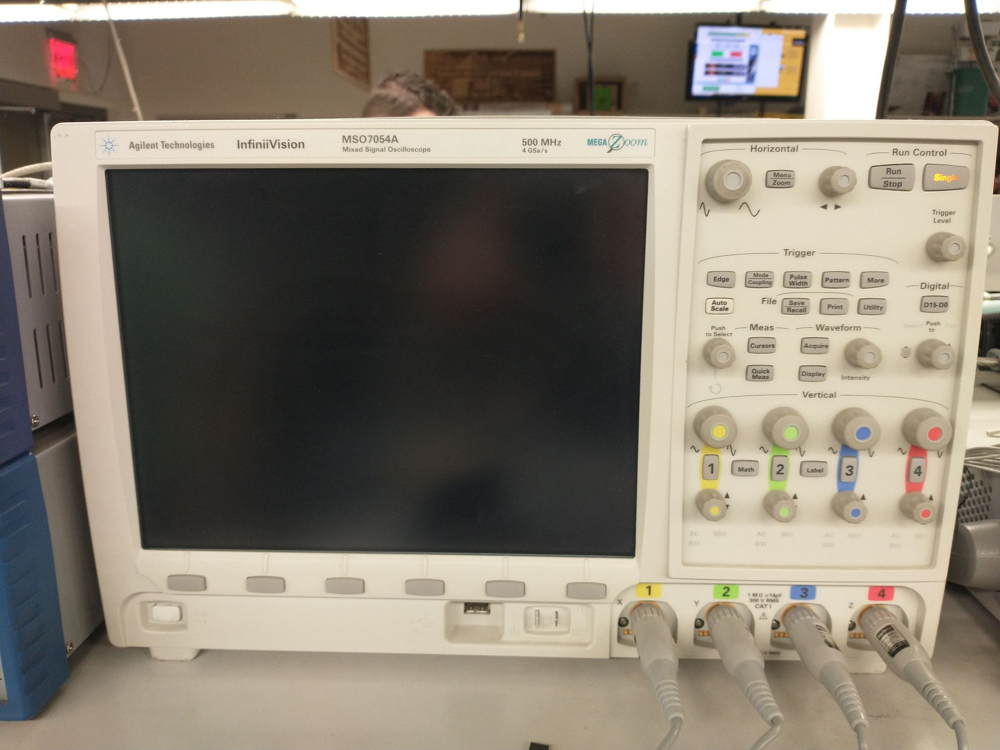

> This assignment is a ***paired in-class checkoff***. An **individual** live demonstration is required. You may work in pairs (**one** partner), but must individually demonstrate your working breadboard.

## Objectives

In this assignment, you will learn to design filter circuits for analog signal conditioning. These circuits are common for designing on an analog circuit, and will be used in your semester project. You will also learn how to use benchtop oscilloscopes to observe signal plots and waveforms from output of signal generators as well as how to use these generators to output appropriate signals. Oscilloscopes will be used for observing how a filter circuit filters out unwanted parts of analog signals.

You must demonstrate with your partner proficiency in:

1. Designing and breadboarding a low-pass filter.
2. Setting up a function generator with specific desired frequencies.
3. Testing and measuring output signals of a function generator and a low-pass filter by using an oscilloscope.

> This in-class checkoff requires advance work in order to complete it within one class period. Please read through the ICC, read all datasheets, and prepare your circuits as much as possible.

## Resources

* Scherz & Monk, Chapter 7: Hands on Electronics
    * Section 7.4.1 How Scopes Work
    * Section 7.4.7 thru 7.4.8 - Scope Applications, Measuring Impedances
    * Section 7.5.5-7.5.7 Oscilloscope, Probes, and Function Generator
* Scherz & Monk Chapter 9: Basic Filters & Passive Filter Design
* [BK Precision 5 MHz Function Generator (Model 4011A)](https://www.bkprecision.com/products/signal-generators/4011A) ([manual](https://bkpmedia.s3.us-west-1.amazonaws.com/downloads/manuals/en-us/4010A_4011A_manual.pdf))
* [Agilent InfiniiVision Mixed Signal Oscilloscope (Model 4024A)](https://www.keysight.com/us/en/support/DSOX4024A/oscilloscope-200-mhz-4-analog-channels.html) ([manual](https://www.keysight.com/us/en/assets/9018-03807/user-manuals/9018-03807.pdf))
* Video Tutorials:
    * In Class Checkoffs -- Adjusting output frequencies through the function generator : <https://www.youtube.com/watch?v=xo40zzxYB48>
    * In Class Checkoffs -- Oscilloscope Part 1 - Initial setups on an oscilloscope: <https://www.youtube.com/watch?v=ot87_OiE_cQ>
    * In Class Checkoffs -- Oscilloscope Part 2 - Adding measurements through an oscilloscope: <https://www.youtube.com/watch?v=1djtVekO_kI>

## Bill of Materials

| **Item**                    | **Quantity** | **Value(s)**                       |
| :-------------------------- | :----------- | :--------------------------------- |
| Breadboard                  | 1            |                                    |
| Jumper wires                | Several      |                                    |
| Capacitor                   | 1            | Various: 0.1 µF (104), 10 µF (106) |
| Resistors                   | Several      | Various                            |
| Benchtop function generator | 1            |                                    |
| Benchtop oscilloscope       | 1            |                                    |

## Prior to Class

1. Read Scherz & Monk Sections 9.1 and 9.2 to learn what a filter is.

## Prior to Demonstration of Proficiency

1. Discuss what you learned from Scherz & Monk Sections 9.1 and 9.2 with your partner.
2. Design a low-pass filter with a 50 Hz cutoff. Look in Section 9.2 of the textbook, find the equation of cutoff frequency ($f_c$) in a low-pass filter. You need to select one of two existing capacitors first (i.e., select an existing value of capacitance - 0.1 µF (104) or 10 µF (106)). Then, apply the equation you find to calculate the value of resistance. Select a resistor that has a corresponding resistance with the resistance you calculated.
3. Construct a low-pass filter circuit on your breadboard with a resistor and a capacitor you selected. You may review Section 9.2 of the textbook for the circuit.
4. Turn on the BK Precision function generator and setup by:
    1. Turning knobs of "DUTY CYCLE", "CMOS LEVEL", "DC OFFSET", and "OUTPUT LEVEL" all the way down, and then back up the output level between 25 - 50%.
    1. Turning knobs of "COARSE" and "FINE" all the way down. You will turn the COARSE knob to set the frequency.
    1. Making sure buttons for "DUTY CYCLE", "CMOS LEVEL", "DC OFFSET", and "-20 dB" are *off*.
    1. Setting the waveform as a sine wave by pressing the sine wave button.
5. Set the frequency at **5 Hz** for the output signal from the function generator. Press the range button 5 to output and turn the **COARSE** knob until reaching a frequency of 5 Hz.
    * [Video Demo 1 - Adjusting frequencies through the function generator](https://www.youtube.com/watch?v=xo40zzxYB48).
6. Connect the probes of the function generator to the input of your circuit as well as one of four probes on the Agilent oscilloscope with jumper wires. Make sure the black alligator cable on the oscilloscope connects to ground to enable referencing higher output.
7. Connect another set of oscilloscope probes to the output of your low-pass filter circuit. Review Section 9.2 of the textbook and find which node is the output in a low-pass filter circuit. Make sure to ground the black alligator cable on the oscilloscope.
8. Turn on and set up the Agilent oscilloscope. Watch the following videos and learn how to set up an oscilloscope, zoom to useful signal waveforms, and measure frequencies. Then, add measurements of frequencies to measure output frequencies of signals from the function generator and your low-pass filter.
    * [Video Demo 2 Part 1 - Initial setups on an oscilloscope](https://www.youtube.com/watch?v=ot87_OiE_cQ)
    * [Video Demo 2 Part 2 - Adding measurements through an oscilloscope](https://www.youtube.com/watch?v=1djtVekO_kI)
9. (*Optional*) Auto-trigger the output frequency from your low-pass filter by referencing the output frequency from the function generator.
10. Adjust the **OUTPUT LEVEL** knob of the BK Precision function generator so that the oscilloscope measures 5V peak to peak amplitude of the output signal.
11. Repeat steps 4-11 with the function generator set to **500Hz**. What is the difference you see at the output of the low-pass filter?
12. Flip the position of the resistor and capacitor in the circuit to create a high pass filter. Repeat steps 5-11, at both 5Hz and 500Hz. The cutoff frequency should be the same, but the behavior will be quite different. Can you tell the difference?

## Individual Demonstration of Proficiency

In class, demonstrate the following **live** to a member of the Teaching Team by the end of class:

1. Demonstrating, with the oscilloscope, that the output of the function generator is correctly set to at 5Hz, 5V amplitude.
2. Demonstrating, with the oscilloscope, your measurement of amplitude and frequency of the signal at the output of the low-pass filter at 5Hz.
3. Demonstrating, with the oscilloscope, that the output of the function generator is correctly set to at 500Hz, 5V amplitude.
4. Demonstrating, with the oscilloscope, your measurement of amplitude and frequency of the signal at the output of the low-pass filter at 500Hz.
5. Demonstrating, with the oscilloscope, your measurement of amplitude and frequency of the signal at the output of the high-pass filter at 5Hz.
6. Demonstrating, with the oscilloscope, your measurement of amplitude and frequency of the signal at the output of the high-pass filter at 500Hz.

**A live demonstration by the end of class is required. No late demonstrations will be accepted.**

## Canvas Submission

**No Canvas submission is required.**

## Grading

| **Demonstration**   | **Points** |
| ------------------- | ---------- |
| 1.  Demonstration 1 | 5         |
| 2.  Demonstration 2 | 5         |
| 3.  Demonstration 3 | 10         |
| 4.  Demonstration 4 | 10         |
| 5.  Demonstration 5 | 10         |
| 6.  Demonstration 6 | 10         |
| **Total**           | **50**     |

### Devices

|     |  |  |
| ------------------ | --------------- | --------------- |
| Digital Multimeter | Oscilloscope    | Power Supply    |
| (Not Used)         | (Used)          | (Not Used)      |

|     |    |  |
| ------------------ | ------------------ | --------------- |
| Function Generator | Waveform Generator | Soldering Iron  |
| (Used)             | (Not Used)         | (Not Used)      |

### Probes

|  |     |  |
| --------------- | ------------------ | --------------- |
| Oscilloscope    | Digital Multimeter | Soldering Iron  |
| (Used)          | (Not Used)         | (Not Used)      |
