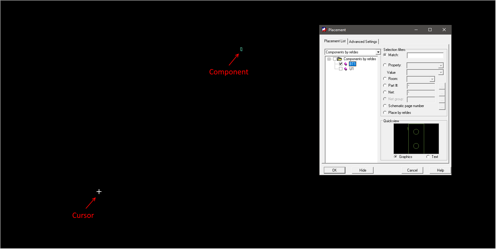
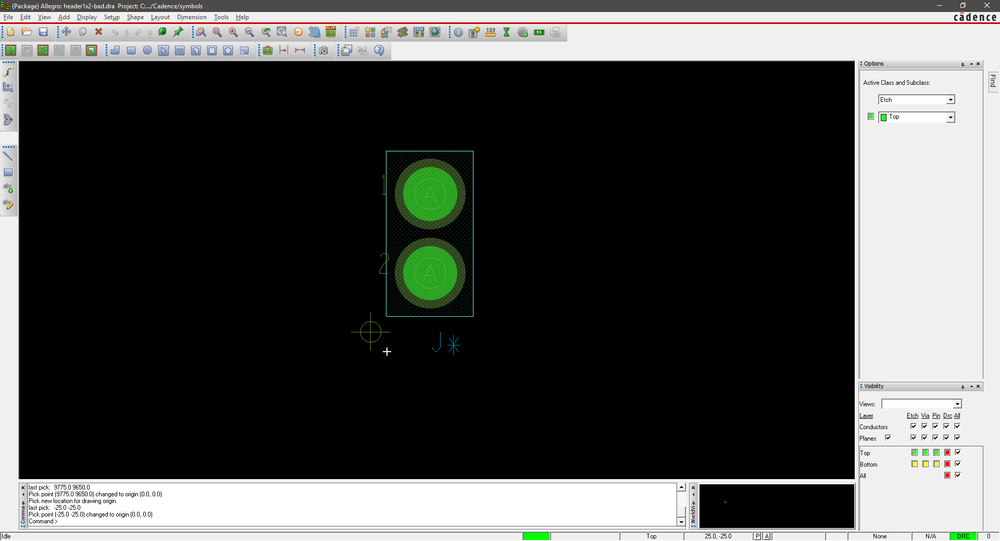
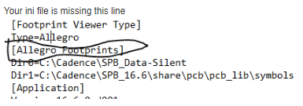

***Team Assignment***

## Objectives

In this assignment, you will create a **single team printed circuit board (PCB) layout** that combines together all of the parts of your team's system into a single PCB$^1$. Your team must demonstrate proficiency in:

1. Using printed circuit board (PCB) layout software to create a custom PCB layout in Cadence or KiCad$^2$

2. Creating a **working** custom PCB design and having it manufactured professionally. You will be using the PCB manufactured in this assignment to verify your design in a later assignment.

**This is a team assignment.** You must work with your team to complete the assignment.

> ***Note:* Failure to complete this assignment on time could significantly impact your success in completing this project by the end of the semester.**

If all of your team members were able to fully check off their individual subsystem PCBs prior to submitting this assignment, you can submit your team PCB for external manufacturing. If your team has unverified subsystems, then your team PCB will be manufactured in Peralta so that you have more time to debug.

<p></p>

> ***Alert:*** KiCad is only permitted in EGR 304.

## Resources

- [Cadence posts](https://embedded-systems-design.github.io/cadence/) on the Embedded Systems Design Resources blog
- [KiCad$^2$ posts](https://embedded-systems-design.github.io/kicad/) on the Embedded Systems Design Resources blog
- [Peralta PCB Mill Specs](https://peraltastudios.engineering.asu.edu/pcb-mill-specs/)
- [Trace Width Calculator](https://www.4pcb.com/trace-width-calculator.html) from Advanced Circuits
- [KiCAD Design for Manufacturing DFM Checker Configuration](https://docs.google.com/document/d/1qzu49MeOHpfvNXcJdFl30Zo8oPzRPyJBf6s6kh7oHPc/edit?usp=sharing)
- Book: [Complete PCB Design Using OrCAD Capture and PCB Editor](http://search.ebscohost.com.ezproxy1.lib.asu.edu/login.aspx?direct=true&db=nlebk&AN=249296&site=ehost-live&ebv=EB&ppid=pp_iii)
- [Summary of PCB Design Steps](https://embedded-systems-design.github.io/pcb-tutorial-notes/)
- <https://embedded-systems-design.github.io/packaging-cadence-files-for-submission/>
- <https://embedded-systems-design.github.io/how-to-export-a-pdf-from-capture-and-pcb-editor/>
- Canvas discussion board

## Instructions

1. Update your schematic to make changes or correct errors discovered during the design process. Export your schematic to a ```.pdf```.

2. **Transfer Schematic to a PCB Editor**

    Every component in your schematic must have a "footprint" (a land pattern that will etched in the copper). Make footprints and transfer your schematic to a PCB Editor. Follow the instructions for transferring a schematic to a PCB Design ([Cadence](https://embedded-systems-design.github.io/transferring-a-cadence-schematic-to-pcb-editor/) / [KiCad$^2$](https://embedded-systems-design.github.io/kicad/transferring-kicad-schematics-to-pcb/)) page.

    1. Custom footprints must include the initials of the subsystem's designer, and should be part of a custom footprint library named with their initials as well.

    1. All custom footprint libraries must be included in the submission

3. *Cadence Only:* Configure AutoSave in the PCB Editor see the "Configuring Cadence" tutorials ([standalone](https://embedded-systems-design.github.io/configuring-cadence/) / [cloud](https://embedded-systems-design.github.io/configuring-cadence-cloud/)).

4. Open up your PCB editor and set up the DRC [Constraints (Cadence)](https://embedded-systems-design.github.io/setting-up-cadence-drc-constraints/) or [Rules (KiCad$^2$)](https://embedded-systems-design.github.io/pcb-design-rules-setup-in-kicad/) for your project.

5. **Create a PCB Layout** for your entire team design. See the PCB Design Overviews for [Cadence](https://embedded-systems-design.github.io/getting-started-with-cadence-pcb-editor/) or [KiCad$^2$](https://embedded-systems-design.github.io/kicad-pcb-design-tutorial/) webpage for more information on how to use the PCB design tools. Your PCB design must meet all of the [Peralta PCB Mill Specs](https://peraltastudios.engineering.asu.edu/pcb-mill-specs/), with the following additions/exceptions:

    1. 2 copper layers (top and bottom), top and bottom layer soldermask, and top layer silkscreen *(optional)*.

    1. **Maximum size 3.93701 inches x 3.93701 inches** (100 mm x 100 mm). Use the measurement tools in your PCB Designer to confirm your PCB size ([Cadence](https://embedded-systems-design.github.io/measurement-in-cadence-pcb-editor/) / KiCad$^2$)
    > *Board size exceptions must be approved in writing by your professor.*

    1. Designs will be manufactured on a 0.5 oz/ft$^{\text{2}}$ double-sided copper PCB. If any of your traces will carry more than 500 mA, you must use a [trace width calculator](https://www.4pcb.com/trace-width-calculator.html) to ensure your traces are wide enough to handle the higher current. As necessary, update the trace widths in your design ([Cadence](https://embedded-systems-design.github.io/altering-trace-widths/) / KiCad$^2$). **This step is critical to preventing PCB traces from burning or catching fire.**
    > *Copper thickness exceptions must be approved in writing by your professor.*

    1. Ground plane on both sides of your PCB design. Copper power and ground planes shield electromagnetic waves. Make sure the antenna of your wireless module does not have copper underneath it, either by rubbing out the copper or by hanging the antenna off the edge of your PCB. See how to create a ground plane ([Cadence](https://embedded-systems-design.github.io/creating-a-ground-plane-in-cadence-pcb-editor/) / [KiCad$^2$](https://embedded-systems-design.github.io/kicad-pcb-design-tutorial/) (step 4) ) for more information.

    1. [Add your team number in a* ***LARGE BOLD FONT](https://embedded-systems-design.github.io/adding-text-to-a-layout-in-Cadence-pcb-editor/) to the **TOP COPPER** **layer** in your PCB design.

9. **Verify and Fabricate**

    1. Run a Design Rules Check (DRC) in your PCB Editor([Cadence](https://embedded-systems-design.github.io/running-design-rules-check-in-cadence-pcb-editor/) / [KiCad$^2$](https://embedded-systems-design.github.io/pcb-design-rules-setup-in-kicad/)) and fix any errors identified.

    1. Export Gerber files ([Cadence](https://embedded-systems-design.github.io/exporting-gerber-files-from-cadence-pcb-editor/) / [KiCad$^2$](https://embedded-systems-design.github.io/exporting-gerber-from-kicad/)). You must export all of the following files:

        - Top copper layer
        - Bottom copper layer
        - Top solder mask layer
        - Bottom solder mask layer
        - Board outline layer
        - Silkscreen layer (top or bottom, but not both)
        - Drill file

    1. *(optional but highly recommended)* Run a Design for Manufacturing (DFM)check on your Gerber files using the [KiCAD DFM Checker](- [Peralta 109 Design for Manufacturing Checker](https://peraltastudios.engineering.asu.edu/wp-content/uploads/2021/08/dfmchecker.html)
), and fix any errors identified. Save a PDF of the successful DFM check.
    1. Confirm that the size of your PCB is within the specification above using the measurement tools in your PCB Editor ([Cadence](https://embedded-systems-design.github.io/measurement-in-cadence-pcb-editor/) / KiCad$^2$).
    1. Print a 1:1 (100%)-sized copy of your PCB design([Cadence](https://embedded-systems-design.github.io/printing-a-pcb-layout-in-cadence-pcb-editor/)) | [KiCad$^2$](https://embedded-systems-design.github.io/packaging-kicad-files-for-submission/)) and physically place all components on the printout to confirm that the footprints are correct. This is particularly important for ICs, connectors, and daughterboards.
    1. Zip all of your PCB files together in one ZIP folder with filename ```YourName###.zip```, where ```###``` is your team number.
        - ```Top.art``
        - ```Bottom.art``
        - ```Outline.art``
        - ```Drill.drl``
        - ```SolderMaskTop.art``
        - ```SolderMaskBottom.art``
        - ```SilkscreenTop.art``
        - ```SilkscreenBottom.art``
    1. ***304 unverified subsystem(s)*** Submit your files at <http://fultonapps.asu.edu/polylab>. Include the following information in the request details:
          - Professor and class
          - Quantity of boards *(only 1 allowed per design; exceptions allowed with professor approval)*
          - Solder mask needed? *(only allowed for final board designs)*
          - Rub out area needed? If yes, specify location. (*Pro tip:* Rub out copper underneath antennas)
          - Copper thickness (0.5, 1, or 2 oz/ft<sup>2</sup>)
          - You must also attach the following files to your request:
          - ZIP of your Gerber files created above
          - *(optional but highly recommended)* PDF of the results of the [Design for Manufacturing Checking tool](- [Peralta 109 Design for Manufacturing Checker](https://peraltastudios.engineering.asu.edu/wp-content/uploads/2021/08/dfmchecker.html))
    1. ***304 fully verified subsystem(s)*** Submit your ZIP file and DFM check results to the [Team PCB Submission for Manufacturing Form](https://docs.google.com/forms/d/e/1FAIpQLSfiQMixyRtf2KASSx6KMuiF5OxXLCyAEvDNC-5o2fv9-xWOxg/viewform?usp=sf_link). Each team will receive 5 copies of their team PCB design.
    1. Submit your design to Canvas. ***Note:*** Submitting your design to Canvas does not automatically submit it for manufacturing, and vice-versa.
    1. **Order Parts:** Communicate with your team members and verify that all parts have been ordered. Submit new orders ASAP
    1. ***(314 V2 Only)*** Ensure your team Alpha prototype has been verified.  You must verify your team board before submitting V2 for fabrication.

## Submission Instructions

This work will be used in multiple ways. It will be reviewed for feedback in class on the date given in Canvas, so please be prepared to discuss it with a member of the teaching team.

### Draft Checkoff: Schematic and PCB project files and .pdf's

Follow the instructions for packaging your schematic ([KiCad$^2$](https://embedded-systems-design.github.io/packaging-kicad-files-for-submission/) / [Cadence](https://embedded-systems-design.github.io/packaging-cadence-files-for-submission/)) to create a PDF of your schematic, as well as a ZIP archive (including all library files) of your entire project, including all custom libraries, footprints, padstacks, etc. **Do not submit screenshots of your schematic.**

Take a screenshot of the top and bottom layers of your PCB editor window and create a pdf of those two screenshots using Adobe, Google Drive, Word, etc.

Submit PDF and ZIP files as separate documents to Canvas, by the deadline indicated.

### Final Submission 

**Do not submit screenshots.** *Do not submit links to Google documents.* It is your responsibility to ensure that your submission to [Canvas](https://canvas.asu.edu) was successful. Late Canvas submissions will be graded per the policy in the syllabus. No credit will be awarded for assignments not submitted to Canvas.

#### Schematic and PCB project files and .pdf's

Follow the instructions for packaging your schematic ([KiCad$^2$](https://embedded-systems-design.github.io/packaging-kicad-files-for-submission/) / [Cadence](https://embedded-systems-design.github.io/packaging-cadence-files-for-submission/)) to create a PDF of your schematic, as well as a ZIP archive (including all library files) of your entire project, including all custom libraries, footprints, padstacks, etc. **Do not submit screenshots of your schematic.**

Take a screenshot of the top and bottom layers of your PCB editor window and create a pdf of those two screenshots using Adobe, Google Drive, Word, etc.

Submit PDF and ZIP files as separate documents to Canvas, by the deadline indicated.

#### PCB Artwork (Gerber Files)

Follow the instructions for exporting design artwork ([Cadence](https://embedded-systems-design.github.io/exporting-gerber-files-from-cadence-pcb-editor/) / [KiCad$^2$](https://embedded-systems-design.github.io/exporting-gerber-from-kicad/)) to create Gerber and drill files of your design. Combine the Gerber and drill files into a **separate** ZIP archive. Submit the ZIP archive to this assignment on Canvas by the deadline in Canvas.

#### Passing Design Rules Check

Your final submission should include a PDF showing both your design **and** the results of your DRC check of your design **with no errors** in the same frame. Please follow the instructions for setting up and running a design rules check in [KiCad$^2$](https://embedded-systems-design.github.io/pcb-design-rules-setup-in-kicad/) or [Cadence](https://embedded-systems-design.github.io/running-design-rules-check-in-cadence-pcb-editor/).

#### *(not required, not currently working)* Design For Manufacturing Confirmation

Follow the instructions on the [ASU PCB Fabrication Process page](https://embedded-systems-design.github.io/asu-pcb-fabrication-process/) to run a design for manufacturing check on your design with the [Peralta 109 Design for Manufacturing Checker](https://peraltastudios.engineering.asu.edu/designmanufacturingcheck/). Resolve all errors and submit a screenshot or video showing both your PCB layout **and** the results of your DFM check in the same image. **Your submission must be individually identifiable and not edited in order to receive credit.**

#### Confirmation of Submission for Manufacturing (required)

Your PCB design must be submitted for manufacturing by the assignment due date. You will receive a confirmation of the submission via email from Peralta Studios. Submit the ***confirmation email*** as proof of submission to Canvas. **This step is required.** Your PCB design must be submitted for manufacturing by the assignment due date*.*

> Keep in mind the submission requirements differ whether you are submitting to Peralta or externally.

## Grading

| **Item**                                                                                                                                                                                                                                                             | **Points** |
| -------------------------------------------------------------------------------------------------------------------------------------------------------------------------------------------------------------------------------------------------------------------- | ---------- |
| Full draft schematic and PCB layout submitted to Canvas for in-class feedback and checkoff                                                                                                                                                                                         | 50         |
| **Schematic and Board Layout ZIP.** Updated KiCad$^2$/Cadence project folder including completed schematic and PCB design files in one .zip file submitted to canvas                                                                                                 | 25         |
| **Schematic PDF and Board Layout PDF.** Completed legible schematic **and** completed legible PCB design in PDF format only.*(required for grading)*<br>*-10 points per schematic or board layout mistake up to -75 points, or 0 points if either PDF is illegible.* | 75         |
| **Gerber Files ZIP.** All Gerber and drill files in a second ZIP file                                                                                                                                                                                                | 25         |
| **DRC Printout.** PDF that proves that your team design has passed the DRC check. Your submission must be uniquely identifiable as being for your design.                                                                                                            | 75         |
| 0 - 5 errors = 100%                                                                                                                                                                                                                                                  |            |
| 6 - 10 errors = 85%                                                                                                                                                                                                                                                  |            |
| 11 - 15 errors = 70%                                                                                                                                                                                                                                                 |            |
| 16 - 20 errors = 55%                                                                                                                                                                                                                                                 |            |
| 21 - 30 errors = 40%                                                                                                                                                                                                                                                 |            |
| 31 - 40 errors = 25%                                                                                                                                                                                                                                                 |            |
| 41 - 50 errors = 10%                                                                                                                                                                                                                                                 |            |
| > 51 errors = 0                                                                                                                                                                                                                                                      |            |
| **Confirmation of Submission for Manufacturing**                                                                                                                                                                                                                     | 50         |
| **Total**                                                                                                                                                                                                                                                            | **300**    |

In order to manufacture your PCB, your design must be submitted for manufacturing by the assignment due date*.*

*Note: You may only manufacture one PCB design (one copy for each team member) for this assignment.*

## Frequently Asked Questions

**Q:** I need help! When are office hours?

**A:** See Canvas for up-to-date information on office hours.

**Q:** How many times can I re-spin (re-manufacture) my PCB for this assignment?

**A:** You may only manufacture one PCB design (1 spin) for this assignment. If there are mistakes in the design after it is manufactured, please see your professor or the TAs for help in reworking your PCB to fix them.


Additionally, using wires to connect to offboard sensors and actuators is encouraged. We strongly recommend using screw terminals or crimp connectors for this purpose.

**Q:** I was designing a custom padstack for my part and was wondering if my hole size should correspond to a drill size listed on the [PCB Mill Specs](https://peraltastudios.engineering.asu.edu/pcb-mill-specs/) page. For example I have a part with square pins that are 22.04 x 20.47 mils. Should I make it a circular hole 23.6 mil in diameter because that is what they have a bit for?

**A:** Yes

**Q:** I am trying to connect pins on my PCB using traces. I can select the first pin easily; however, when I try to click the second pin, I get "DRC error(s) created." in the command line. The only design rules errors I received when netlisting my schematic was that some of the pins (VDDA, VDDR, and XRES on the PSoC specifically) were unconnected, and this error message pops up when I try to connect built-in components as well. Because of this, I can't make any traces on my board. How do I fix this?

**A:** In the PCB editor, do the two pins that you are trying to connect have a thin blue line between them? If these lines are not showing up, it could indicate that the pins are not connected on the schematic. If this is the case, the PCB editor will not allow you to add a trace between the pins.


Is there anything close to where you are trying to run the trace that might be causing a clearance issue (other pins, ground plane, etc)? This will also prevent the PCB editor from adding a trace.


**Q:** I'm trying to create my PCB layout, but when I go to select a part I want to place on the board, it appears in the preview box but once selected, nothing shows up on the cursor for me to place. Any suggestions as to what I can do?

**A:** Check the location of the origin in the symbol file (.dra) for the part you are trying to place. If it is not near the symbol, the symbol will appear offset from the cursor and sometimes will be off of the screen.

Symbol file:


When placing this symbol:



To fix this, you can move the drawing origin using the option in the setup menu. You can either click near the component to set the new origin, or place it at a precise location by typing coordinates in the command line (e.g. "x 500 500").




For more information on using the command line to enter coordinates, see: [https://embedded-systems-design.github.io/placing-and-moving-components-in-cadence-pcb-editor/](https://embedded-systems-design.github.io/placing-and-moving-components-in-cadence-pcb-editor/)

**Q:** I keep getting this error: "Net has fewer than two connections N00437"

**A:** A "net" in cadence refers to a connection (I.e. a wire or trace). The "fewer than two connections" error is most common when a pin is labeled with a net alias but the net alias is not used elsewhere. Try going to edit>browse>nets and click on the one named N00437 to show it on your schematic. This might help pinpoint the source of the error.

Examples would be the three connections shown below:


To fix this, either remove the netlist symbol or add a matching symbol in the correct location. For example, the circuit above could be fixed by removing net1 and adding a battery connector component with GND and 5V symbols:


**Q:** I am having trouble with path errors even after having correctly set up the config.ini file and the PCB editor settings. Do any of the other TAs have a solution to this? This sounds like it might be similar to a problem you helped someone with earlier in the week?

**A:** I found a couple of posts from last year's forum that could be related. Also see the instructors' answer below.




And...


In addition to the instructions on the ESD blog, I also found it useful to bring all my custom paths to the top of the search order in PCB Editor. This seemed to have a positive impact for me.

Make sure you do not have spaces in any of the pathnames that you enter.

**Q:** I am trying to remake my footprint for my microcontroller and when I try to put in "x 100 -900" i keep receiving this error "Pick is outside the extent of the drawing ... pick again.". What can I do to fix this error?

**A:** You can fix this error by going into Setup> Design Parameters, and choosing the minimum x and y distances to be -10000. The reason why you are getting this error is because the default minimums are set to 0 for both x and y, thus -900 is not defined. See below:


**Q:** My board got rejected due to via size issues. What should I do?

**A:** The default via pad in cadence is too small to be manufactured on our mill. Please see the following [tutorial](https://embedded-systems-design.github.io/changing-the-default-via-padstack-in-cadence-pcb-editor/) on how to fix this problem to avoid DFM errors or rejected PCB's. Increasing the size also makes the vias easier to work with during debugging and testing.

**Q:** When I try and route a trace through a VIA (double click) it will not switch to the backside of the PCB. I noticed on the left in the options it shows 'Top', 'Bottom', and 'No available via'. Any idea why I cant add vias?

**A:** Inside Allegro PCB Designer,

1. Setup -> Constraints -> Constraint Manager

2. 'Physical' tab

3. Net -> 'All Layers'

4. Select 8th column (Vias)

5. Double click each cell and select your favorite VIA

6. Close -> Enjoy

**Q:** PCB Editor will not open and it keeps complaining about a license server problem

**A:** If the PCB editor will not open due to a licensing error, make sure that you have the AnyConnect VPN running. Instructions for installing this can be found here: [https://myapps.asu.edu/app/cisco-ssl-vpn-pc-46x](https://myapps.asu.edu/app/cisco-ssl-vpn-pc-46x). This applies whether you are on campus or off campus.

Q: I get "ERROR: Property "PCB Footprint" missing from instance --"

A: You need to 1) ensure that each schematic symbol has an associated footprint (double click the schematic item and ensure that the footprint entry is not blank; and 2) ensure that your paths have been set up correctly to find those footprints (see blog entry on cadence configuration).

$^1$ Exceptions allowed with prior approval from your professor

$^2$ KiCad is only permitted in EGR304
