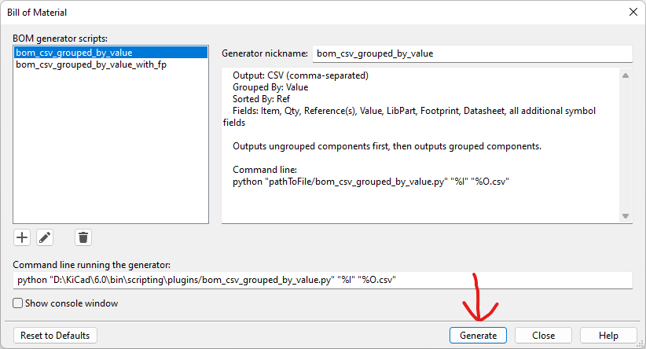
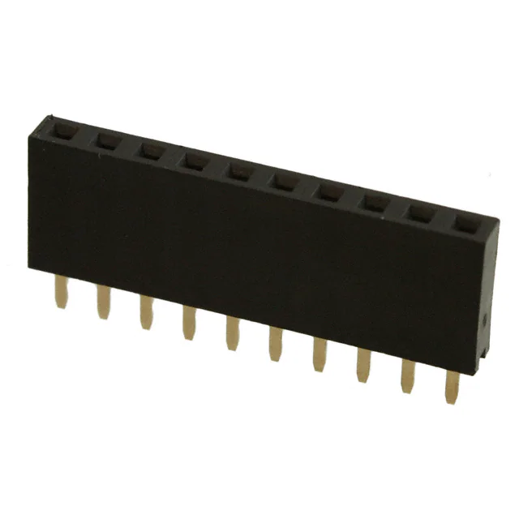
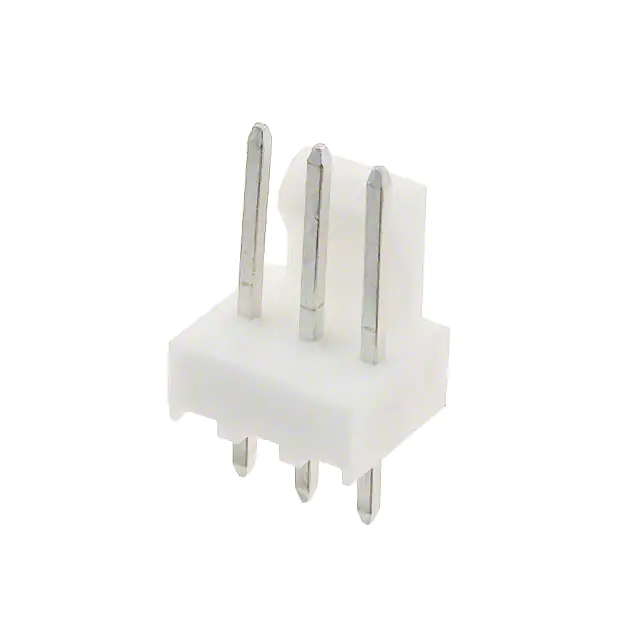
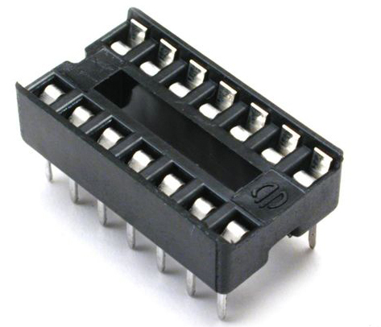

> This ICC includes both an individual and team-based checkoff.
>
> * An **individual** checkoff of **one BOM per individual/subsystem** is required. You may work together as a team to discuss, but must each check off your BOM with a member of the teaching team.
> * A **team** checkoff of **one order per vendor** is required. You may work together as a team to discuss, and your team's combined order will be checked off when all parts are present

> **Please email your orders ASAP so that you don't miss later deadlines because of components not arriving in time!**

## Objectives

The purpose of this in-class checkoff is to complete your order form and obtain final buy-in from staff for the bulk of the parts you will need.

## Resources

* Embedded Systems Website:
    * [Sources for Electrical and Electromechanical Components](https://embedded-systems-design.github.io/sources-for-electrical-and-electromechanical-components/)
    * [From where can I source parts?](https://embedded-systems-design.github.io/from-where-can-i-source-parts/)
* [Component List](https://www.dropbox.com/s/k8ihfv7x51vmyhm/Spring%202023%20Order%20Planning.xlsx?dl=0) of all parts distributed in ICCs or purchased for Peralta 109 general stock
* [Bill of Materials example](https://www.dropbox.com/s/urnlk2rn0xu6hih/Bill%20of%20Materials%20Example.xlsx?dl=0)
* Canvas discussion board
* [Ordering Resources](https://www.dropbox.com/sh/0pu5curaf0s2bs8/AAC_PwZxVOF_R2ny7IMxwVjea?dl=0) folder
* [Class Order Form Template](https://www.dropbox.com/scl/fi/zhj1hgknkkmxri7umonv2/EGR-3x4-Purchase-Request-2021.xlsx?rlkey=b1t6y9gduqhp0jgk74gpbt737&dl=0)

## Instructions

1. Compile a bill of materials (BOM) that includes all of the components shown in your schematic.
    * KiCad$^1$
        1. In the KiCad$^1$ schematic menu, navigate to tools→ generate BOM

            {style="max-height:200px;"}

        1. Select in the left window bom_csv_grouped_by_value

            {style="max-height:200px;"}

        1. At the bottom click generate. This will generate a .csv file that you can open up and modify in Excel

            {style="max-height:200px;"}

    * Cadence
        1. In Cadence, navigate to Tools menu > Bill of Materials... to export a spreadsheet file that can be modified in Excel.
1. Using the Bill of Materials example (linked above) along with your team's block diagram, component selection, hardware proposal, and individual **Subsystem Design** assignment schematic submissions, add any other components you may need.
    * List all components, even if they are found in Peralta or were handed out in class.
    * Download all datasheets and store them in your team drive for later.
    * Don't forget to include hardware for debugging, expandability, and error-proofing, such as:

    | item                                          | notes                                                                                                                                                                                                                                                           |
    | --------------------------------------------- | --------------------------------------------------------------------------------------------------------------------------------------------------------------------------------------------------------------------------------------------------------------- |
    | test points                                   | {style="max-height:100px;"}                                                                                                                                                                                                                      |
    | jumpers                                       | {style="max-height:100px;"}{style="max-height:100px;"}                                                                                                                                                                            |
    | male/female headers                           | {style="max-height:100px;"}{style="max-height:100px;"}                                                                                                                                                                            |
    |                                               | *Note:* You don't need to order the exact size of header you need, if something longer is in stock. You can always cut a longer header to fit a smaller size. for example, if you have a 1x40 header, you can snap off 12 pins if you need a twelve-pin header. |
    |                                               | *Note:* Remember that the spacing on a breadboard is 2.54mm, or .1"                                                                                                                                                                                             |
    | "pcb-mount" connectors, sockets, and/or plugs | {style="max-height:100px;"}                                                                                                                                                                                                                      |
    |                                               | *Note:* "Molex" and "JST" are two, well-regarded brands that are considered the "kleenex" of connectors; these are good keywords to begin your search with.                                                                                                     |
    | fuses and fuse holders                        | *Note:* We have a selection of fuses, which can be found in Peralta 109.                                                                                                                                                                                        |
    | IC sockets                                    | {style="max-height:100px;"}                                                                                                                                                                                                                      |
    |                                               | *Note:* We have a wide selection of IC sockets on hand, which can be found in the parts closet in Peralta 109.                                                                                                                                                  |

1. Create a copy of the BOM template linked above, adding the information required. **Order more than the minimum number needed.** This includes:
    * **1x per instance** for your individual subsystem checkoff (to go in the pcb you manufacture or thru-hole plated perfboard you solder). This is ideally not surface mount and is breadboard-compatible so you can test quickly on a breadboard before you migrate to your PCB.
    * **1x per instance** for your team board. You can use any package compatible with Peralta's PCB fabrication tolerances.
    * **1x-2x per instance** extra in case of damage.

    > *Note:* considering delivery times and the cost of shipping vs the likely minimal cost of the part, please order at least 1-2 extra parts than you need per instance on the board, unless it can be found in plenty in Peralta. |

    _This step can then be checked off individually._

1. Merge all BOMs into a single spreadsheet
1. Sort the spreadsheet by vendor
1. Create **one order form per vendor** by copying the class order form template linked above

    *This step can then be checked off for the team.*

1. When satisfied with your order, submit your team's order forms to your instructor for final approval. Please email your order as an XLSX attachment (to facilitate easy ordering by the ASU Poly Business team)
    * 304
        * 10:30 AM - Dr. Daniel Aukes <[danaukes@asu.edu](mailto:danaukes@asu.edu)>
        * 1:30 PM - Dr. Kevin Nichols <[kwnicho@asu.edu](mailto:kwnicho@asu.edu)>
    * 314
        * 4:30 PM - Dr. Kevin Nichols <[kwnicho@asu.edu](mailto:kwnicho@asu.edu)>

## Canvas Submission

No Canvas submission is required.

## Grading

### EGR304

| **Demonstration**                                    | **Points** |
| ---------------------------------------------------- | ---------- |
| 1.  Checkoff 1: Individually-completed subsystem BOM | 25         |
| 2.  Checkoff 2: Team-completed order forms           | 25         |
| **Total**                                            | **50**     |

### EGR314

| **Demonstration**                                    | **Points** |
| ---------------------------------------------------- | ---------- |
| 1.  Checkoff 1: Individually-completed subsystem BOM | 75         |
| 2.  Checkoff 2: Team-completed order forms           | 75         |
| **Total**                                            | **150**    |

$^1$ KiCad is only permitted in EGR304
