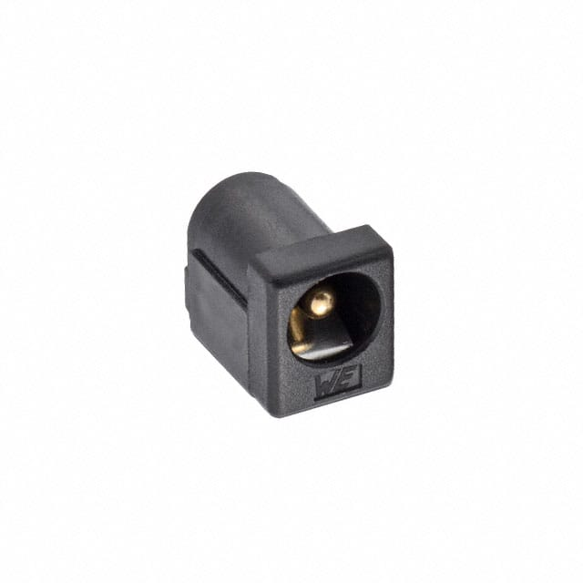
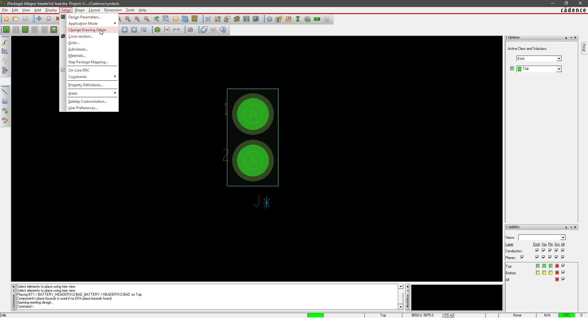
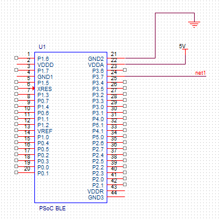
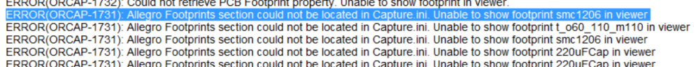

> **This is an individual homework assignment** but you may work with others to determine how to complete the assignment.

## Objectives

The purpose of the individual **Subsystem Design** and **Subsystem Verification** assignments is to demonstrate proficiency in the design of an embedded system from beginning to end. These two homework assignments take you through this sequence.

1. **Subsystem Design:** Schematic update/creation and printed circuit board (PCB) layout.
1. **Subsystem Verification:** Population and Verification (upcoming assignment)

Each assignment is due on a separate date, as indicated on Canvas.

In the **Subsystem Design** assignment, you will create a schematic for the microcontroller **and** the individual subsystem(s) assigned to you on the block diagram for your team project. This may be heavily adapted from one of the circuits you created in prior assignments, or designed fresh, based on your team's product requirements. You will then create the printed circuit board (PCB) layout.

You must individually demonstrate proficiency in:

1. Using the KiCad$^{1,2}$ or Cadence$^{3}$ ECAD software package to create a schematic for the subsystem(s) you are responsible for in the project
1. Using KiCad$^{1,2}$ or Cadence$^{3}$ printed circuit board (PCB) layout software to create a custom PCB layout.
1. Submitting a validated PCB design for manufacture using an [LPKF ProtoMat S63 Printed Circuit Board Mill](https://www.lpkfusa.com/datasheets/prototyping/s63.pdf).

$^1$ KiCad is only permitted in 304

$^2$ KiCad$^1$ is an open-source, cross-platform tool that is lighter-weight and a smaller download.

$^3$ Cadence is a professional-level industry-standard tool that takes time to download (~15 GB), install (>1 hour), and learn. *Please plan accordingly*.

### Assignment Differences by Semester

| Item          | EGR304                                                                                                                                                                                            | EGR314                                               |
| ------------- | ------------------------------------------------------------------------------------------------------------------------------------------------------------------------------------------------- | ---------------------------------------------------- |
| ECAD Software | You may use KiCad or Cadence to complete this assignment                                                                                                                                          | You **MUST** use Cadence to complete this assignment |
| Fabrication   | You may elect to fabricate your PCB. (If you do not, you must hand-manufacture a thru-hole plated perfboard for the [Subsystem Verification assignment](/3x4/3x4-ind-subsystem-verification/).) | You must fabricate your PCB                          |
| Verification  | You may verify on a PCB or soldered through-hole protoboard                                                                                                                                       | You must verify on a custom PCB                      |

## Resources

* Scherz, P., & Monk, S. (2016). [Practical electronics for inventors, fourth edition.](https://www.amazon.com/Practical-Electronics-Inventors-Fourth-Scherz/dp/1259587541/ref=sr_1_1?s=books&ie=UTF8&qid=1470699914&sr=1-1&keywords=practical+electronics+for+inventors+4th+edition) New York: McGraw Hill. ISBN: 978-1259587542 *(**many** circuit design resources)*
* [Ordering Information](https://www.dropbox.com/sh/0pu5curaf0s2bs8/AAC_PwZxVOF_R2ny7IMxwVjea?dl=0) folder
* [Example Schematic](https://www.dropbox.com/s/ixg2uu3bmf9254d/GameControllerV2.pdf?dl=0)
* [Video Walkthrough of (similar previous) Assignment](https://youtu.be/B46Mo9aK-qY)
* Cadence
    * [Summary of PCB Design Steps](https://embedded-systems-design.github.io/pcb-tutorial-notes/)
    * [Cadence posts](https://embedded-systems-design.github.io/cadence) on the Embedded Systems Design Resources blog
    * [Measurement in Cadence PCB Editor](https://embedded-systems-design.github.io/measurement-in-cadence-pcb-editor/)
    * Book: [Complete PCB Design Using OrCAD Capture and PCB Editor](http://search.ebscohost.com.ezproxy1.lib.asu.edu/login.aspx?direct=true&db=nlebk&AN=249296&site=ehost-live&ebv=EB&ppid=pp_iii)
* KiCad
    * [Kiad$^1$ posts](https://embedded-systems-design.github.io/kicad/) on the Embedded Systems Design Resources blog

* Manufacturing Requirements
    * [Peralta PCB Mill Specs](https://peraltastudios.engineering.asu.edu/pcb-mill-specs/)
    * [Trace Width Calculator](https://www.4pcb.com/trace-width-calculator.html) from Advanced Circuits
    * [Peralta 109 Design for Manufacturing Checker](https://peraltastudios.engineering.asu.edu/wp-content/uploads/2021/08/dfmchecker.html)

* Canvas discussion board

* ***(304 only)*** [Supply Kit BOM](https://www.dropbox.com/scl/fi/dqc5mybx9erigglhs1stg/EGR304-F23-Kit-Bill-of-Materials.xlsx?rlkey=amyoz9eakhtdwinqngsxa4fh0&dl=0)

* ***(314 only)*** Hardware Information
    * [ESP32](https://embedded-systems-design.github.io/overview-of-the-esp32-devkit-doit-v1/)
    * [OLED](https://www.amazon.com/Songhe-0-96-inch-I2C-Raspberry/dp/B085WCRS7C/)

## Instructions

*Complete all of the steps below prior to submitting your assignment to Canvas.*

1. Study the following critical information and concepts:

    | **Critical Information and Concepts**                          | **Importance**                                                                                                                                                                                                                                                               |
    | -------------------------------------------------------------- | ---------------------------------------------------------------------------------------------------------------------------------------------------------------------------------------------------------------------------------------------------------------------------- |
    | a.  What is a printed circuit board (PCB)?                     | You will be creating a custom PCB in this assignment, so it is important to understand the different parts and terminology. Can be found in the [What is a Printed Circuit Board?](https://embedded-systems-design.github.io/what-is-a-printed-circuit-board/) blog entry. |
    | b.  How do we manufacture PCBs at ASU?                         | ASU has in-house PCB manufacturing capabilities. See the [ASU PCB Fabrication Process](https://embedded-systems-design.github.io/asu-pcb-fabrication-process/) blog entry and watch the [Peralta PCB Mill Process](https://www.youtube.com/watch?v=DJPIYXGpPVo) video.   |
    | c.  What are the minimum manufacturing requirements for a PCB? | Required to ensure manufacturability and reliability of your PCB design. Review the [Peralta Labs PCB Specifications](https://peraltastudios.engineering.asu.edu/pcb-mill-specs/). Note the recommended minimum trace widths for both power/ground and signal traces.      |

1. Create a schematic for a microcontroller and your individual subsystem (as identified in your Block Diagram) for your team's project.  Coordinate with your team to ensure that all required subsystems are covered by at least one team member.  Make sure to include the following:
    1. Subsystem Circuitry (Microcontroller & Power, Sensor, Actuator):

        **Microcontroller & Power (at least 1 of each per team)**

        * Voltage regulator sized for your team's entire system. ***(314: Switching regulator required)***
        * One of the microcontrollers **in bold** from the list below.
        * All necessary microcontroller support circuitry (according to the datasheet), such as
            * bypass capacitors
            * pullup resistors
            * master clear circuit (PIC)
            * ***(314 only)*** in-system programming header for programming the microcontroller.
        * ***(314 only)*** Surface Mount Packaging required for microcontroller and all passive components.
        * ***(314 only)*** Please provide an ESP32 footprint and/or header pin access to the EUSART subsystem that will be connecting to the ESP32 Devkit.  The DIP Module of the ESP32 is excepted from the surface mount requirement.
        * Remember to provide header pin access for other subsystems to connect to your GPIO Pins
        * Consider adding an extra header to connect to EUSART for debugging purposes.
        * ***(314 only)*** Consider adding an extra header to connect to the OLED (see resources above).

        **Approved Microcontrollers**

        | 304                                | 314                                                                                    |
        | ---------------------------------- | -------------------------------------------------------------------------------------- |
        | **CY8CKit-142 BLE Module$^{1,2}$** | **The PIC selected via your team's<br>microcontroller selection (surface mount only)** |
        | **CY8CKit-143 BLE Module$^{1,2}$** | PIC18F47Q10 (DIP)$^3$                                                                  |
        | Cypress PSoC CY8CKIT-142$^1$       | PIC18F47Q10 Curiosity Nano$^3$                                                         |

        > $^1$ (you will **not** use the bare PSoC IC)

        <p></p>

        > $^2$ Your footprint design for the PSoC should use two sets of male, 2xN .1"-spacing header pins for each side of the CY8CKIT-142/143 BLE module, where N is the number of rows on each side of the BLE module.

        <p></p>

        > $^3$ DIP sockets / headers are available for this package and should be used rather than directly soldering to the part.

        **Sensor (at least 1 per team)**

        * Sensor, or HEADERx pins (where x is determined by the number of pins required to select the right header length) if the sensor will not be mounted on the PCB. Make sure to include pins for power and ground.
        * A properly designed and selected op-amp stage (other amplifiers must be approved by instructor). **Required for 304**, as needed for 314.
        * A properly-designed and selected low-pass or high-pass signal conditioning stage. (Work with instructor to select the appropriate filter).  **Required for 304**, as needed for 314.
        * A way for the microcontroller to output that it is working (e.g., an LED).
        * Any microcontroller from the approved list below.
        * ***(304 only)*** Please provide a footprint or header pins for mounting the microcontroller.  DIP packages are okay.  DIP sockets / headers are available for this package and should be used rather than directly soldering to the part.
        * ***(314 only)*** Please provide a footprint for mounting the microcontroller.  DIP packages are okay.  DIP sockets / headers are available for this package and should be used rather than directly soldering to the part.
        * ***(314 only)*** Surface Mount Packaging required for all components except the microcontroller.
        * ***(314 only)*** If you would like to use your subsystem board for the [system prototype](/314/314-team-12-system-prototype/) assignment, make sure your I$^2$C resistors can be removed / jumpered out.

        **Actuator (at least 1 per team)**

        * Actuator, or HEADERx pins (where x is determined by the number of pins required to select the right header length) if the actuator will not be mounted on the PCB. Make sure to include pins for power and ground.
        * All necessary signal conditioning, interfacing, and driver circuitry, including back-EMF diodes(if necessary) and H-Bridge driver.
        * Any microcontroller from the approved list below.
        * ***(304 only)*** Please provide a footprint or header pins for mounting the microcontroller.  DIP packages are okay.  DIP sockets / headers are available for this package and should be used rather than directly soldering to the part.
        * ***(314 only)*** Please provide a footprint for mounting the microcontroller.  DIP packages are okay.  DIP sockets / headers are available for this package and should be used rather than directly soldering to the part.
        * ***(314 only)*** Surface Mount Packaging required for all components except the microcontroller.
        * ***(314 only)*** If you would like to use your subsystem board for the [system prototype](/314/314-team-12-system-prototype/) assignment, make sure your I$^2$C resistors can be removed / jumpered
  
    1. At least one custom schematic symbol.
    1. 0.1 µF [bypass capacitors](https://embedded-systems-design.github.io/bypass-capacitor-basics/) on **every** power pin (unless otherwise specified in the datasheet).
    1. A short text label describing each section of the circuit.
    1. All needed resistors, capacitors, inductors, etc. (see the datasheet for your major components)
    1. Connectors or headers for power and all signals coming into and leaving the board (e.g., HEADER parts from the Connector library). This includes connectors for switches, sensors, and actuators that will not be mounted directly to your PCB.
    1. At least one debugging LED (through-hole or surface mount) with a current-limiting resistor (surface mount) attached to an unused microcontroller I/O pin.
    1. At least one [button with a pull-up resistor](https://embedded-systems-design.github.io/pull-down-resistors/) for debugging.
    1. A power connector (e.g., a through-hole barrel jack) so you can connect an external power supply to the board.

        

1. Review your schematic against the [Schematic Checklist](https://embedded-systems-design.github.io/schematic-checklist/) on the embedded systems design website. This is very important and will save you debugging time later in the semester.
1. Every component in your schematic must have a "footprint" (a land pattern that will be etched in the copper). Make footprints and transfer your schematic to PCB. Follow the instructions for transferring a schematic to a PCB Design ([Cadence](https://embedded-systems-design.github.io/transferring-a-cadence-schematic-to-pcb-editor/) / [KiCad$^1$](https://embedded-systems-design.github.io/kicad/transferring-kicad-schematics-to-pcb/)) page.
    1. Custom footprints must include your initials, and should be part of a custom footprint library named with your initials as well
    1. Your footprint library must be included in your submission
1. *Cadence only:* Configure AutoSave in the PCB Editor. See the "Configuring Cadence" tutorials ([standalone](https://embedded-systems-design.github.io/configuring-cadence/) / [cloud](https://embedded-systems-design.github.io/configuring-cadence-cloud/))
1. Open up the PCB editor and set up the DRC rules ([cadence](https://embedded-systems-design.github.io/setting-up-cadence-drc-constraints/) / [KiCad$^1$](https://embedded-systems-design.github.io/pcb-design-rules-setup-in-kicad/)) for your project.
1. **Create a PCB Layout** for your individual design. See the PCB Design Overviews for [Cadence](https://embedded-systems-design.github.io/getting-started-with-cadence-pcb-editor/) or [KiCad$^1$](https://embedded-systems-design.github.io/kicad-pcb-design-tutorial/) webpage for more information on how to use the PCB design tools. Your PCB design must meet all of the [Peralta PCB Mill Specs](https://peraltastudios.engineering.asu.edu/pcb-mill-specs/), with the following additions/exceptions:

    1. 2 copper layers (top and bottom), no soldermask or silkscreen.
    1. **Maximum size 3.93701 inches x 3.93701 inches** (100 mm x 100 mm). Use the measurement tools in your PCB Designer to confirm your PCB size ([Cadence](https://embedded-systems-design.github.io/measurement-in-cadence-pcb-editor/) / KiCad$^1$)

        > *Board size exceptions must be approved in writing by your professor.*

    1. Designs will be manufactured on a 0.5 oz/ft$^{\text{2}}$ double-sided copper PCB. If any of your traces will carry more than 500 mA, you must use a [trace width calculator](https://www.4pcb.com/trace-width-calculator.html) to ensure your traces are wide enough to handle the higher current. As necessary, update the trace widths in your design ([Cadence](https://embedded-systems-design.github.io/altering-trace-widths/) / KiCad$^1$). **This step is critical to preventing PCB traces from burning or catching fire.**

        > *Copper thickness exceptions must be approved in writing by your professor.*

    1. Ground plane on both sides of your PCB design. Copper power and ground planes shield electromagnetic waves. Make sure the antenna of your wireless module does not have copper underneath it, either by rubbing out the copper or by hanging the antenna off the edge of your PCB. See how to create a ground plane ([Cadence](https://embedded-systems-design.github.io/creating-a-ground-plane-in-cadence-pcb-editor/) / [KiCad$^1$](https://embedded-systems-design.github.io/kicad-pcb-design-tutorial/) (step 4) ) for more information.
    1. Add your **initials** in a **LARGE BOLD FONT** to the **TOP COPPER** **layer** in your PCB design ([Cadence](https://embedded-systems-design.github.io/adding-text-to-a-layout-in-cadence-pcb-editor/) / [KiCad$^1$](https://embedded-systems-design.github.io/adding-text-to-pcb-in-kicad/)).

1. Review your PCB Design against the [PCB Checklist](https://embedded-systems-design.github.io/pcb-design-checklist/) on the embedded systems design website. This is very important and will save you debugging time later in the semester.
1. **Verify and Fabricate**

    1. Run a Design Rules Check(DRC) in your PCB editor ([Cadence](https://embedded-systems-design.github.io/running-design-rules-check-in-cadence-pcb-editor/) / [KiCad$^1$](https://embedded-systems-design.github.io/pcb-design-rules-setup-in-kicad/)) and fix any errors identified
    1. Export Gerber files ([Cadence](https://embedded-systems-design.github.io/exporting-gerber-files-from-cadence-pcb-editor/) / [KiCad$^1$](https://embedded-systems-design.github.io/exporting-gerber-from-kicad/)). You must export all of the following files:
        * Top copper layer
        * Bottom copper layer
        * Top solder mask layer
        * Bottom solder mask layer
        * Board outline layer
        * Silkscreen layer (top or bottom, but not both)
        * Drill file
    1. Confirm that the size of your PCB is within the specification above using the measurement tools in your PCB Editor ([Cadence](https://embedded-systems-design.github.io/measurement-in-cadence-pcb-editor/) / KiCad$^1$).
    1. Print a 1:1 (100%)-sized copy of your PCB design ([Cadence](https://embedded-systems-design.github.io/printing-a-pcb-layout-in-cadence-pcb-editor/) / [KiCad$^1$](https://embedded-systems-design.github.io/packaging-kicad-files-for-submission/)) and physically place all components on the printout to confirm that the footprints are correct. This is particularly important for ICs, connectors, and daughterboards.
    1. Zip all of your PCB files together in one ZIP folder with filename ```YourName###.zip```, where ```###``` is your team number.
        * ```Top.art```
        * ```Bottom.art```
        * ```Outline.art```
        * ```Drill.drl```
        * ```SolderMaskTop.art```
        * ```SolderMaskBottom.art```
        * ```SilkscreenTop.art``` *(we want this submitted but will not use it)*
        * ```SilkscreenBottom.art``` *(we want this submitted but will not use it)*
    1. Submit your files at <http://fultonapps.asu.edu/polylab>. Include the following information in the request details:

        * Professor and class
        * Quantity of boards *(only 1 allowed per design; exceptions allowed with professor approval)*
        * Solder mask needed? *(only allowed for final board designs)*
        * Rub out area needed? If yes, specify location.<br>(*Pro tip:* Rub out copper underneath antennas)
        * Copper thickness (0.5, 1, or 2 oz/ft$^{\text{2}}$)
        * You must also attach the following files to your request:
            * ZIP of your Gerber files created above
            * *(not required, not currently working)* PDF of the results of the [Design for Manufacturing Checking tool](https://embedded-systems-design.github.io/cadence-design-for-manufacturing/)
    1. Submit your design to Canvas. ***Note:*** Submitting your design to Canvas does not automatically submit it for manufacturing, and vice-versa.

    > *Note 1: You may only manufacture one PCB per team member for this assignment.*

    <p></p>

    > *Note 2: Later in the semester, you will combine your individual designs into a single team PCB.*

1. **Order Parts:** Communicate with your team members and jointly order *at least* 2 sets of parts needed to build all of the circuits. See the Ordering Resources folder linked above for more information.

## Canvas Submission

**Do not submit screenshots.** *Do not submit links to Google documents.* It is your responsibility to ensure that your submission to [Canvas](https://canvas.asu.edu) was successful. Late Canvas submissions will be graded per the policy in the syllabus. No credit will be awarded for assignments not submitted to Canvas.


### Schematic and PCB project files and PDFs

Follow the instructions for packaging your schematic ([KiCad$^1$](https://embedded-systems-design.github.io/packaging-kicad-files-for-submission/) / [Cadence](https://embedded-systems-design.github.io/packaging-cadence-files-for-submission/)) to create a PDF of your schematic, as well as a ZIP archive of your entire project, including all custom libraries, footprints, padstacks, etc. **Do not submit screenshots of your schematic.**

Take a screenshot of the top and bottom layers of your PCB editor window and create a PDF of those two screenshots using Adobe, Google Drive, Word,etc.

Submit PDF and ZIP files as separate documents to Canvas, by the deadline indicated.

### PCB Artwork (Gerber Files)

Follow the instructions for exporting design artwork ([Cadence](https://embedded-systems-design.github.io/exporting-gerber-files-from-cadence-pcb-editor/) / [KiCad$^1$](https://embedded-systems-design.github.io/exporting-gerber-from-kicad/)) to create Gerber and drill files of your design. Combine the Gerber and drill files into a **separate** ZIP archive. Submit the ZIP archive to this assignment on Canvas by the deadline in Canvas.

### Passing Design Rules Check

Your final submission should include a PDF showing both your design **and** the results of your DRC check of your design **with no errors** in the same frame. Please follow the instructions for setting up and running a design rules check in [KiCad$^1$](https://embedded-systems-design.github.io/pcb-design-rules-setup-in-kicad/) or [Cadence](https://embedded-systems-design.github.io/running-design-rules-check-in-cadence-pcb-editor/).

### Confirmation of Submission for Manufacturing (required)

Your PCB design must be submitted for manufacturing by the assignment due date. You will receive a confirmation of the submission via email from Peralta Studios. Submit the ***confirmation email*** as proof of submission to Canvas. **This step is required, even if you do not plan to manufacture your board.** Your PCB design must be submitted for manufacturing by the assignment due date*.*

## Grading

| **Item**                                                                                                                                                                                                                                                      | **Points** |
| ------------------------------------------------------------------------------------------------------------------------------------------------------------------------------------------------------------------------------------------------------------- | ---------- |
| **Schematic and PCB Layout ZIP.** Updated completed schematic and PCB Editor board design files in one ZIP file                                                                                                                                               | 40         |
| **Schematic and PCB Layout PDF.** Completed legible schematic in PDF format only. Your initials must be included in each custom symbol. <br> *-25 points per schematic mistake and -15 points per board layout mistake. 0 points if either PDF is illegible.* | 400        |
| **Gerber Files ZIP.** All Gerber and drill files in a second ZIP file                                                                                                                                                                                         | 40         |
| **DRC Confirmation.** PDF that proves that your individual design has passed the DRC check. Your submission must be uniquely identifiable as being for your design.                                                                                           | 80         |
| 0 - 5 errors = 100%<br>6 - 10 errors = 85%<br>11 - 15 errors = 70%<br>16 - 20 errors = 55%<br>21 - 30 errors = 40%<br>31 - 40 errors = 25%<br>41 - 50 errors = 10% <br>> 51 errors = 0%                                                                       |            |
| **Design For Manufacturing Confirmation** PDF that proves that your individual design has passed the DFM check. Your submission must be uniquely identifiable as being for your design.                                                                       | 0          |
| **Confirmation of Submission for Manufacturing**                                                                                                                                                                                                              | 40         |
| **Total**                                                                                                                                                                                                                                                     | **600**    |

> *Note: You may only manufacture one PCB per team member for this assignment.*

## Frequently Asked Questions


**Q:** I need help with Cadence! When are your office hours?  
**A:** See Canvas for up-to-date information on office hours.

**Q:** It is difficult to create a schematic without crossing wires. Is it OK if wires cross as long as they do not connect?  
**A:** Wires can cross in a schematic, but there are best practices for making schematics look professional. See the [Keeping a Schematic Tidy](https://embedded-systems-design.github.io/keeping-a-schematic-tidy/) blog entry and/or stop by office hours.

**Q:** If my subsystem is connecting to another team member's subsystem via one or more pins, should I leave those pins empty?  
**A:** At this point, it is best to connect the necessary pin(s) to header pins so that you have a way to physically interface subsystems during future testing.

**Q:** How do you increase the size of the toolbar in Cadence?  
**A:** Experiment with the compatibility settings in Windows. Right click on Orcad Capture Lite, select "Open file location". The program directory will pop up. Right click on the icon for Orcad Capture light, and select "properties"(1). Go to the compatibility tab and select "DPI settings"(2). Try playing with settings (3) and (4).

**Q:** When pulling up libraries when first starting to create a custom schematic symbol, custom library is not coming up as an option. How do I get my custom library to come up?  
**A:** You can create a custom library folder by choosing "File > New > Library". This will create a new library with a default name under Design Resources in the project.


Once you have the custom library created, right-click on the library and choose "New Part".

---

**Q:** I get this error, how do I fix it?

> *Duplicate Pin Name "DRAIN" found on Package IRF520 , Q1 Pin Number 4: SCHEMATIC1, PAGE1 (4.90, 2.30). Please renumber one of these.*

**A:** Select the part, then right click on it and select "Edit Part". If you double click on each of the top two pins, you will see that they both have the name set to "DRAIN". Change the names so that they do not match. For example, "DRAIN1" and "DRAIN2":

Close the part editor tab and when it asks if you want to update the part, select "Update All" then "Yes". Save the file and try netlisting again.

**Q:** I need help! When are your office hours?  
**A:** See Canvas for up-to-date information on office hours.

**Q:** How many times can I re-spin (re-manufacture) my PCB for this assignment?  
**A:** You may only manufacture your PCB design one time (1 spin) for this assignment. If there are mistakes in the design after it is manufactured, please see your professor or the TAs for help in reworking your PCB to fix them.

**Q:** I was designing a custom padstack for my part and was wondering if my hole size should correspond to a drill size listed on the [PCB Mill Specs](https://peraltastudios.engineering.asu.edu/pcb-mill-specs/) page. For example I have a part with square pins that are 22.04 x 20.47 mils. Should I make it a circular hole 23.6 mil in diameter because that is what they have a bit for?  
**A:** Yes please! This will make your board faster to manufacture and reduce wear on the tools in Peralta Lab.

**Q:** I am trying to connect pins on my PCB using traces. I can select the first pin easily; however, when I try to click the second pin, I get "DRC error(s) created." in the command line. The only design rules errors I received when netlisting my schematic was that some of the pins (VDDA, VDDR, and XRES on the PSoC specifically) were unconnected, and this error message pops up when I try to connect built-in components as well. Because of this, I can't make any traces on my board. How do I fix this?  
**A:** In the PCB editor, do the two pins that you are trying to connect have a thin blue line between them? If these lines are not showing up, it could indicate that the pins are not connected on the schematic. If this is the case, the PCB editor will not allow you to add a trace between the pins.


Is there anything close to where you are trying to run the trace that might be causing a clearance issue (other pins, ground plane, etc)? This will also prevent the PCB editor from adding a trace.


---

**Q:** I'm trying to create my PCB layout, but when I go to select a part I want to place on the board, it appears in the preview box but once selected, nothing shows up on the cursor for me to place. Any suggestions as to what I can do?  
**A:** Check the location of the origin in the symbol file (.dra) for the part you are trying to place. If it is not near the symbol, the symbol will appear offset from the cursor and sometimes will be off of the screen.

Symbol file:


When placing this symbol:


To fix this, you can move the drawing origin using the option in the setup menu. You can either click near the component to set the new origin, or place it at a precise location by typing coordinates in the command line (e.g. "x 500 500").




For more information on using the command line to enter coordinates, see: [https://embedded-systems-design.github.io/placing-and-moving-components-in-cadence-pcb-editor/](https://embedded-systems-design.github.io/placing-and-moving-components-in-cadence-pcb-editor/)

---

**Q:** I keep getting this error: "Net has fewer than two connections N00437"  
**A:** A "net" in Cadencerefers to a connection (I.e. a wire or trace). The "fewer than two connections" error is most common when a pin is labeled with a net alias but the net alias is not used elsewhere. Try going to edit>browse>nets and click on the one named N00437 to show it on your schematic. This might help pinpoint the source of the error.

Examples would be the three connections shown below:



To fix this, either remove the netlist symbol or add a matching symbol in the correct location. For example, the circuit above could be fixed by removing net1 and adding a battery connector component with GND and 5V symbols:


---

**Q:** I am having trouble with path errors even after having correctly set up the config.ini file and the PCB editor settings. Do any of the other TAs have a solution to this? This sounds like it might be similar to a problem you helped someone with earlier in the week?  
**A:** I found a couple of posts from last year's forum that could be related. Also see the instructors' answer below.




And...


In addition to the instructions on the ESD blog, I also found it useful to bring all my custom paths to the top of the search order in pcb editor. This seemed to have a positive impact for me.

Make sure you do not have spaces in any of the pathnames that you enter.

---

**Q:** I am trying to remake my footprint for PSoC and when I try to put in "x 100 -900" i keep receiving this error "Pick is outside the extent of the drawing ... pick again.". What can I do to fix this error?  
**A:** You can fix this error by going into Setup> Design Parameters, and choosing the minimum x and y distances to be -10000. The reason why you are getting this error is because the default minimums are set to 0 for both x and y, thus -900 is not defined. See below:


---

**Q:** My board got rejected due to via size issues. What should I do?  
**A:** The default via pad in Cadence is too small to be manufactured on our mill. Please see the following [tutorial](https://embedded-systems-design.github.io/changing-the-default-via-padstack-in-cadence-pcb-editor/) on how to fix this problem to avoid DFM errors or rejected PCB's. Increasing the size also makes the vias easier to work with during debugging and testing.

**Q:** When I try and route a trace through a VIA (double click) it will not switch to the backside of the PCB. I noticed on the left in the options it shows 'Top', 'Bottom', and 'No available via'. Any idea why I cant add vias?  
**A:** Inside Allegro PCB Designer,

1. Setup -> Constraints -> Constraint Manager
1. 'Physical' tab
1. Net -> 'All Layers'
1. Select 8th column (Vias)
1. Double click each cell and select your favorite VIA
1. Close -> Enjoy

---

***(304 only)***

**Q:** I can't find the PSoC processor module in the Cadence libraries. Do I have to make it by hand?  
**A:** Yes

$^1$ KiCad is only permitted in 304

<!--

    1. *(not required, not currently working)* Run a Design for Manufacturing check on your Gerber files using the [Peralta 109 Design for Manufacturing Checker](https://peraltastudios.engineering.asu.edu/designmanufacturingcheck/), and fix any errors identified. Save a PDF of the successful DFM check.

### Design For Manufacturing Confirmation

Follow the instructions on the [ASU PCB Fabrication Process page](https://embedded-systems-design.github.io/asu-pcb-fabrication-process/) to run a design for manufacturing check on your design with the [Peralta 109 Design for Manufacturing Checker](https://peraltastudios.engineering.asu.edu/designmanufacturingcheck/). Resolve all errors and submit a screenshot or video showing both your PCB layout **and** the results of your DFM check in the same image. **Your submission must be individually identifiable and not edited in order to receive credit.**

| **Design For Manufacturing Confirmation** PDF that proves that your individual design has passed the DFM check. Your submission must be uniquely identifiable as being for your design.                                                                       | 25         |

    > **(304)** Update and combine the schematics from prior assignments, including the power supply, microcontroller, MOSFET driver, H-bridge, or op-amp designs from HW1 - HW4, as identified in your Block Diagram for the project.
-->
