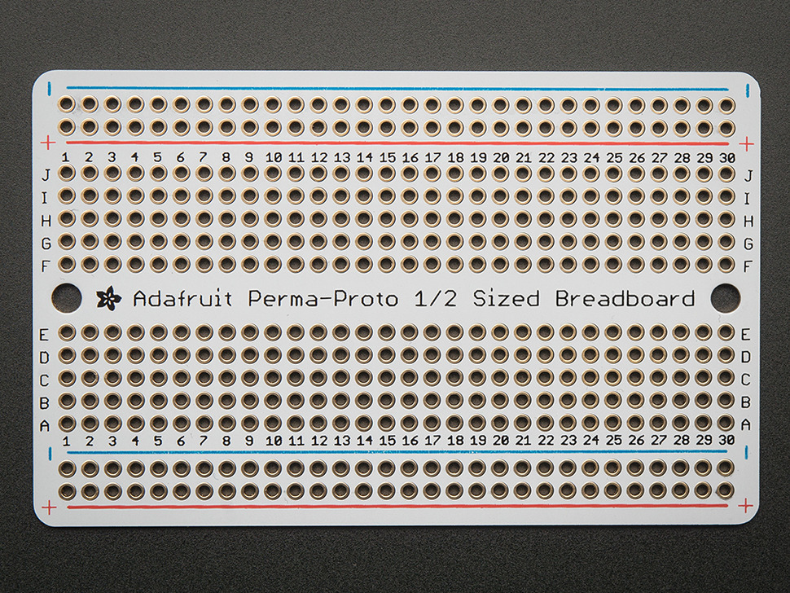

"Testing can show the presence of errors, but not their absence"  
\- Edsger Dijkstra, computer scientist (1930-2002)

> **This is an individual homework assignment** but you may work with others to determine how to complete the assignment.  All work demonstrated in checkoff must be completed by you on your own board.

## Objectives

In this assignment, you will test your subsystem design for the individual subsystem(s) assigned to you on the block diagram for your team project. You must individually demonstrate proficiency in:

1. Powering up your board and circuit
1. Showing your circuit functioning in the way it is intended

**This is an individual assignment** but you may work with others to determine how to complete the assignment. You must individually demonstrate proficiency.

***(304 only)*** If all of your team members are able to fully check off their subsystem PCBs, your team's final PCB can be professionally manufactured instead of being manufactured in Peralta.

## Resources

* [PCB Fabrication Process](https://embedded-systems-design.github.io/asu-pcb-fabrication-process/) on the Embedded Systems Design Resources Blog
* [Peralta 103 Resources](https://embedded-systems-design.github.io/peralta-103-resources/) on the Embedded Systems Design Resources Blog (includes links to manuals for the oscilloscopes and function generators in PRLTA 103)
* [Soldering and Desoldering Tips and Tricks](https://embedded-systems-design.github.io/soldering-and-desoldering-tips-and-tricks/) on the Embedded Systems Design Resources Blog
* [The "Soldering Is Easy" Complete Comic Book](https://mightyohm.com/blog/2011/04/soldering-is-easy-comic-book/)
* [Soldering Tutorial for Beginners Five Easy Steps](https://www.youtube.com/watch?v=8lq85feAiLM) video
* Canvas discussion board

## Prior to Demonstration of Proficiency

*Complete all of the steps below prior to the demonstration of proficiency.*

> ***EGR304:*** You must complete this assignment using either 1) a custom PCB designed by you from the individual **Subsystem Design** assignment **or** a thru-hole plated perfboard (see FAQ). **You may not use a breadboard, evaluation board, or your team's full PCB. See the FAQ below for a comparison of permitted board types**

> ***EGR314:*** You must complete this assignment using a custom PCB designed by you from individual **Subsystem Design** assignment. **You may not use a breadboard, perfboard, evaluation board, or your team's full PCB.**

1. Update your schematic and board design to match any changes which occurred prior to or after board manufacturing. *All documents must be up-to-date, easy to read, and must be consistent with each other.*
1. Solder all headers and connectors to your subsystem PCB.
1. Solder your power connector and any associated components (e.g., voltage regulator, bypass capacitor) to your PCB.
1. **Do not solder or connect expensive components (e.g., your microcontroller) until you have verified power and ground are going to the correct pins on the PCB.** Connect power to the PCB and verify the following using a multimeter (handheld or benchtop).
    1. Correct voltage is coming into the PCB as expected.
    1. If your PCB includes a voltage regulator, the correct voltage is coming out of the regulator.
    1. Looking at your schematic, confirm that the correct power supply voltage is going to all of the correct pins on the PCB.
    1. If any mistakes are discovered, modify the PCB by cutting traces and soldering jumper wires until the design is correct. Update the schematic and/or PCB design in Cadence accordingly to account for these issues.
1. Solder one set of subsystem components to the PCB. If you have multiple subsystems on a single PCB, pick one to start with.
1. Verify the functionality of a subsystem. See demonstration of proficiency below for the tests you must run to confirm functionality of each subsystem.
1. Repeat steps 5 and 6 for each section/subsystem of your PCB design
1. If your board doesn't have your name etched in the copper, write your name in Sharpie somewhere in a blank area of your board. **This is required for verification.**

## Individual Demonstration of Proficiency

*You must complete the demonstration individually, either in office hours or in class if time permits.*

> ***EGR304:*** You must complete this assignment using either 1) a custom PCB designed by you from your individual **Subsystem Design** assignment **or** a thru-hole plated perfboard (see FAQ). **You may not use a breadboard, evaluation board, or your team's full PCB. See the FAQ below for a comparison of permitted board types**

> ***EGR314:*** You must complete this assignment using a custom PCB designed by you from your individual **Subsystem Design** assignment. **You may not use a breadboard, perfboard, evaluation board, or your team's full PCB.**

1. Open and talk through the block diagram and schematic for your subsystem PCB. *All documents must be up-to-date, easy to read, and must be consistent with each other.*
1. Show in the block diagram which subsystems have your name on them. These are the subsystems that you are responsible for.
1. Power up your physical subsystem PCB and show with a multimeter that the correct regulated voltage is connected to **all** of the correct pins (e.g., all of the VCC pins on the microcontroller) on the PCB
1. Demonstrate that your board has your name on it.
1. Demonstrate the correct functionality of at least one of your assigned subsystems on your PCB. (If you have multiple assigned subsystems on your PCB, you only need to demonstrate one besides the power supply).

| **Type of Subsystem**           | **Test 1**                                                                                                                   | **Test 2**                                                                                                          | **Test 3**                                                                                                                                                   |
| ------------------------------- | ---------------------------------------------------------------------------------------------------------------------------- | ------------------------------------------------------------------------------------------------------------------- | ------------------------------------------------------------------------------------------------------------------------------------------------------------ |
| PSoC + BLE ***(304 only)*** | Demonstrate powering your PSoC via an external power connector (not the onboard USB)                                        | Unplug external power, connect your PSoC to the computer, and demonstrate blinking an external LED                 | Demonstrate a potentiometer being read by the PSoC controlling the delay between LED blinks. (You can connect a potentiometer to extra pins in your design) |
| PIC ***(314 only)***         | Demonstrate using the MPLAB SNAP to successfully program and verify via ICSP your main microcontroller soldered to your PCB | Following successful ICSP, demonstrate your main microcontroller soldered to your PCB making an output change state | Following successful ICSP, demonstrate your main microcontroller soldered to your PCB making an output change state based on reading an input                |
| ESP32 ***(314 only)***       | Demonstrate programming the ESP32 with MicroPython and successfully downloading code                                         | Demonstrate web-based programming on your ESP32 to make the onboard LED blink                                       | Demonstrate bi-directional EUSART communication between your main microcontroller and ESP32 (via the PCB)                                                    |
| Analog Sensor                   | Verify pre-amplified sensor signal with oscilloscope or DMM                                                                  | Verify post-amplified signal with oscilloscope or DMM                                                               | Verify microcontroller is reading amplified signal                                                                                                           |
| Serial Sensor                   | Demonstrate that the serial sensor is powered from the power supply.                                                         | Verify that serial data is coming out of the sensor with an oscilloscope or DMM                                     | Demonstrate controlling an actuator (e.g., LED) to turn on and off or reverse based on the current value of the sensor                                       |
| Serial Actuator                 | Demonstrate that the serial actuator is powered from the power supply.                                                       | Verify that serial data is coming out of the microcontroller connected to the serial actuator with an oscilloscope  | Demonstrate controlling the serial actuator to turn on and off based on the current value of a sensor (e.g., button)                                         |
| Bidirectional Motor             | Demonstrate motor controlled by the microcontroller to rotate in one direction                                               | Demonstrate motor controlled by the microcontroller to rotate in the opposite direction                             | Demonstrate motor alternating directions based on sensing a state change on a pin (e.g. pushbutton to change direction) through the microcontroller.                                     |
| Stepper Motor                   | Demonstrate motor controlled by the microcontroller to run at a slow speed                                                   | Demonstrate motor controlled by the microcontroller to run at a fast speed                                          | Demonstrate motor controlled by the microcontroller to run in both directions                                                                                |
| Switching Output                | Verify driver signal from microcontroller with DMM                                                                           | Verify low-current signal from transistor with DMM                                                                  | Verify high-current signal from transistor with DMM                                                                                                          |
| PWM Output / RGB LED            | Verify duty cycle from microcontroller with DMM                                                                              | Verify different duty cycle from microcontroller with DMM                                                           | Demonstrate subsystem that uses PWM functioning as a result of the signal                                                                                    |
| SD Card (read/write)            | Write file from computer. Read file info from microcontroller to some output. Demonstrate on at least two different files.   | Write file from microcontroller. Read file info on computer. Demonstrate writing at least two different files.      | Read and write file from microcontroller. Demonstrate on at least two different files.                                                                       |
| Speaker                         | Verify analog signal output from DAC or audio signal generator controlled by microcontroller                                 | Verify analog signal output from amplifier                                                                          | Verify speaker outputs sound                                                                                                                                 |
| Voice Recorder IC               | Verify power going to IC                                                                                                     | Verify recording works                                                                                              | Verify playback works, controlled by the microcontroller                                                                                                     |
| UART MP3 Player IC              | Verify power going to IC                                                                                                     | Verify initiating playback of a song from the microcontroller                                                       | Verify switching from one song to another when a button is pressed                                                                                           |
| LCD Screen                      | Verify power going to LCD screen                                                                                             | Verify displaying a single message on the LCD screen                                                                | Verify changing the text on the LCD screen based on an input (button or potentiometer)                                                                       |
| Other                           | Develop a custom plan with your professor in advance                                                                         |                                                                                                                     |                                                                                                                                                              |

## Canvas Submission

Please submit your ***final*** *updated* subsystem design based on prior checkpoints, including schematic and board layout. Your final submission should include 2 PDF files (one of the schematic and another of the PCB layout) and 1 ZIP file of the IDE project. *Do not submit links to Google documents.* It is your responsibility to ensure that your submission to [Canvas](https://canvas.asu.edu) was successful. Late [Canvas](https://canvas.asu.edu) submissions will be graded per the policy in the syllabus. No credit will be awarded for assignments not submitted to [Canvas](https://canvas.asu.edu).

**Your schematic and PCB PDFs must be legible in order to be graded. Rasterized (pixelated) images will receive a 0 if they are illegible. Do not submit screenshots.**

### 1. Legible Schematic and Board Layout PDF

Follow the [Packaging a Cadence Schematic Project for Submission to Canvas](https://embedded-systems-design.github.io/packaging-cadence-files-for-submission/) instructions to create PDFs of both your schematic and your PCB layout. You do not need to submit ZIP files of your Cadence project. **Do not submit screenshots.**

### 2. IDE Project ZIP

You must submit the code used in your subsystem PCB demonstration in a single ZIP file.

* In PSoC Creator, right-click on the Workspace, select "Archive Workspace/Project..." from the contextual menu, and select a Minimal archive.

* In MPLabX, right-click on your project name in the Projects window and select "Package".

### 3. Subsystem Testing

Demonstrations may be completed through the date noted in Canvas. Your grade will be documented in a spreadsheet and later uploaded to the Canvas gradebook. Late demonstrations will be graded per the policy in the syllabus.

## Grading

| **Item**                                                                                                                                                                                                                                               | **Points** |
| ------------------------------------------------------------------------------------------------------------------------------------------------------------------------------------------------------------------------------------------------------ | ---------- |
| 1. Completed *updated* legible schematic **and** completed legible PCB design in PDF format only *(required for grading)*  *-10 points per mistake up to -100 points, or 0 points if either the PDF is illegible or no demonstration is completed.* | 100        |
| 2. IDE Project ZIP. *0 points if no demonstration is completed.*                                                                                                                                                                                       | 100        |
| Test 1 successfully demonstrated                                                                                                                                                                                                                       | 100        |
| Test 2 successfully demonstrated                                                                                                                                                                                                                       | 100        |
| Test 3 successfully demonstrated                                                                                                                                                                                                                       | 200        |
| **Total**                                                                                                                                                                                                                                              | **600**    |

* ***This assignment depends on successful completion of of the "Individual Subsystem Design" assignment to receive credit for this part.***
* ***The schematic and board design must match what is manufactured and tested to receive credit for any part of the assignment.***

You must submit to Canvas **and** demonstrate your solution in order to receive credit. Late submissions and demonstrations will be graded per the policy in the syllabus.

## Frequently Asked Questions

**Q:** What is a plated perfboard?

| "Breadboard" PCB (not permitted)     | Plated "Stripboard" (not permitted)  |
| ------------------------------------ | ------------------------------------ |
|  |  |

| Unplated Perfboard (permitted)                                               | Plated Perfboard (recommended)       |
| ---------------------------------------------------------------------------- | ------------------------------------ |
|   |  |

**Q:** I discovered an error in my PCB. May I re-spin (re-manufacture) it?

**A:** Generally, no. Most mistakes can be fixed by cutting traces and soldering wires onto your existing board. Please see the professors or TAs for help in reworking your PCB. Also, it is recommended that you still fix your design in Cadence so that it is ready for the Full PCB assignment later in the semester.

---

**Q:** Do we have to fabricate separate PCBs for each team member? Or could we submit a single PCB since they will be located in the exact same place and be connected together (with other team members schematics/blocks) anyways?

**A:** Each team member needs to submit their own subsystem on a separate PCB. This is to ensure that every student has this skill (a learning outcome of the course). Breaking the board into subsystems also assists in the debugging process. You will combine your debugged subsystems into one final board for your team project.

---

**Q:** Is it possible to submit a video demonstration of our subsystem to canvas?

**A:** No. We require live (non-video) demonstrations in order to confirm your proficiency with the entire process.

---

**Q:** As I was testing and putting the board together I found that somewhere, the voltage input was in contact with ground. I have made several big manual fixes to the board including drilling out a hole to make room for a connector. But just from what I can actually see, there are no solder bridges there. How do I fix this?

**A:** Unfortunately PCBs are tough to debug without seeing live (or virtually). I highly recommend taking advantage of office hours. Having said that, places where you've manually modified the board after manufacturing are a common place where continuity problems occur. Using the continuity tester isn't helpful for locating shorts, so I'd recommend using the ohmmeter and look for a spot with lower resistance to get an idea of where the issue might be.

---

**Q:** Will taking a knife and manually isolating the pads work to fix continuity problems?

**A:** Yes, you can use an exacto knife to isolate the pads, but I would only do that once you've eliminated other possibilities. A TA should be able to help more in office hours.

---

**Q:** I have soldered all my components and am now having a continuity problem. Now what?

**A:** The best way to eliminate continuity problems is to test your before you have soldered on components, and then to test continuity after adding each component so you can trace the problem to your most recent action. Otherwise you will have to methodically desolder components from the board until the short goes away.

Also, sometimes incorrect footprints will cause shorts through the microcontroller. To protect your microcontroller and PCB, attach your microcontroller without power and check for shorts between power and ground. Only then should you power up the board.
