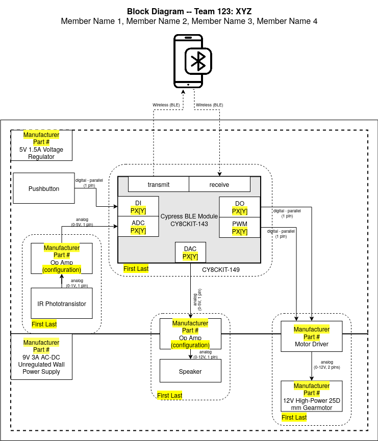

***Team Assignment***

| EGR 304                                          | EGR 314                                              |
| ------------------------------------------------ | ---------------------------------------------------- |
|             |                            |
| 304 Block Diagram Example with PSoC & Bluetooth | 314 Block Diagram Example with PIC, ESP32, and MQTT |

## Objectives

 To define the overall hardware architecture for your team's project, and capture each team member's subsystem in a single combined block diagram, then convert that to a table which will eventually be used for verifying system functionality.

## Resources

* [Drawing Software](https://embedded-systems-design.github.io/drawing-software/) on the Embedded Systems Design blog
* 304 Example block diagram ([draw.io template](https://www.dropbox.com/s/03bsgncmavl72bx/Block%20Diagram-304-BLE.drawio?dl=0))*([full size image](https://www.dropbox.com/s/l0isntlxyjduvtj/Block%20Diagram-304-BLE.drawio.png?dl=0))*
* 314 Example block diagram ([draw.io template](https://www.dropbox.com/s/uk7ylihj48uyjo8/Block%20Diagram-314.drawio?dl=0))*([full size image](https://www.dropbox.com/s/him4lk8pq5rxi8p/Block%20Diagram-314.png?dl=0))*
    * [draw.io getting started](https://www.drawio.com)
* Course Documents
    * [EGR 304/314 Course Sequence Requirements](/3x4/course-sequence-requirements/)
    * [304 Project Description](/304/project-description/)
    * [314 Project Description](/314/project-description/)
    * [Verification Table Example and Template](https://www.dropbox.com/s/b2g9anxlmh5emlj/Verification%20Table%20Example%20and%20Template.xlsx?dl=0)
* Canvas discussion board

**We highly recommended that you closely follow the Example block diagram on the first page and review the [Most Common Mistakes](#most-common-mistakes) section below before completing the assignment.**

## Part 1: Block Diagram

Bring to class on the date noted on the calendar in Canvas for an in-class feedback activity. Teams will be paired and present their drafts to each other for feedback.

Create a block diagram with the following features:

1. **Team information.** Team number, team members, and project name at the top of the block diagram.
1. **Blocks for each major electrical subsystem/component** (e.g., op amps, motor drivers, sensors, actuators). Include manufacturer name **(not distributor)** part numbers (you may always change this later). If the subsystem is an opamp, include the type of amplifier circuit (e.g., non-inverting, inverting, comparator) in parentheses. Read the [EGR 304/314 Course Sequence Requirements](/3x4/course-sequence-requirements/) to review the required sensors, subsystems, and actuators for EGR 304 and 314.
1. **Major blocks for each microcontroller.** There should be at least one microcontroller per team, with space inside for peripherals.
1. **Sub-blocks for each microcontroller peripheral.** Within each microcontroller block, add sub-blocks for each interface peripheral you plan to use in the microcontroller.
    * Indicate the type of peripheral you will use (e.g. PWM, ADC, DAC, UART, etc.). See [Table 1](#table1) for a more detailed explanation of how to label peripherals.
    * Indicate the location on the IC of each pin you will use. Reference the data sheet for each associated subsystem/component that will connect to the microcontroller to determine how many pins are necessary to connect. A range of pins, such as ```PX[Y]-PX[Z]``` should be replaced with the specific port numbers (e.g., ```P3[7]-P3[8]```). A single pin, as in ```PX[Y]```, should be replaced with the port number (e.g., ```P3[7]```).
1. **Microcontroller**

    **(EGR304)** The PSoC CY8CKIT-142 / CY8CKIT-143 BLE module should be shown. The BLE module can be connected to a phone, computer, or other BLE device. *Use dashed lines to indicate wireless transmission.*

    **(EGR314)** A PIC Microcontroller and ESP32 DevKit should be shown. The ESP32 module can be connected via WiFi to the internet, or via bluetooth to a phone, computer or other device. *Use dashed lines to indicate wireless transmission.*

1. **Power supplies.** Include boxes inside each team member's box for each of the power supplies / voltage regulators needed. Place components within each of these boxes to indicate which supply the component requires (or across two adjoining boxes if the component requires both power levels). Label these boxes with the nominal voltage, whether the supply is regulated, and the maximum current available for each supply in a box in the upper left-hand corner.

    > *Please adjust the shape and location of each voltage box as needed to connect neighboring boxes as needed for two-voltage subsystems.*

1. **Directional labeled lines electrically connecting the blocks**. Use solid lines for any physical connection. Include arrows indicating the direction of signal flow. include text labeling the signal type and the number of signal pins. This information is important for determining how many pins and what peripherals (e.g., ADC, SPI) you need on a microcontroller. See [Table* *2](#table2) for examples of common power and signal labels.
1. **Annotations of which individual team member will be responsible for each subsystem and block in the diagram**. Each team member must be responsible for at least 1 acceptable subsystem (see Project Description) in the project. Group blocks assigned to a single team member with a rounded box with dotted lines, as shown in the template.
1. Other information you feel is relevant to help describe the electrical architecture of your project.

*<a name="table1"></a>Table 1: Common microcontroller peripherals, their labels, and use cases.*

| **Type**                                           | **Subsystem Label** | **Typical Uses**                                                                                    |
| :------------------------------------------------- | :------------------ | :-------------------------------------------------------------------------------------------------- |
| Analog to Digital                                  | ADC                 | Converting external analog signals to digital values in a microcontroller                           |
| Digital to Analog                                  | DAC                 | Converting digital values in a microcontroller to external analog signals                           |
| Digital Input                                      | DI                  | Reading pushbuttons, comparators in a microcontroller                                               |
| Digital Output                                     | DO                  | Sending low-current boolean or on/off values to integrated circuits, transistors, or active devices |
| Pulse Width Modulation                             | PWM                 | Sending timed pulse chains to RC Servos or motor drivers                                            |
| Universal Asynchronous Receiver Transmitter (UART) | UART                | Typical serial communication, also known as RS-232                                                  |
|                                                    | SERIAL (EZ-BLE)     |                                                                                                     |
| Serial Peripheral Interface (SPI) Protocol         | SPI                 | Chip-to-chip, chip-to-board, board-to-board communication.                                          |
| I$^{\text{2}}$C Protocol                           | I2C                 | 2-wire chip-to-chip, chip-to-board, board-to-board communication                                    |
| USB-based serial                                   | USB                 | computer-to-microcontroller communication                                                           |
| Bluetooth Low Energy                               | transmit            | transmitting messages to a paired device                                                            |
|                                                    | receive             | receiving messages from a paired device                                                             |

*<a name="table2"></a>Table 2:* Common power and signal types and labels (click the links to learn more)

| **Type**                                                                        | **Label**                                                                 | **Label Examples**                                                                                                                                  | **Typical Uses**                                                                                         |
| ------------------------------------------------------------------------------- | ------------------------------------------------------------------------- | --------------------------------------------------------------------------------------------------------------------------------------------------- | -------------------------------------------------------------------------------------------------------- |
| [Analog](https://learn.sparkfun.com/tutorials/analog-vs-digital)                | Analog (*Minimum Voltage - Maximum Voltage*, *Number of Signal Pins*[^1]) | Analog (0 - 3.3VDC, 1 pin)                                                                                                                          | Analog output sensors, actuators that require an interface block to connect to a microcontroller, opamps |
|                                                                                 |                                                                           | Analog (0 - 5VDC [PWM](https://learn.sparkfun.com/tutorials/pulse-width-modulation), 1 pin)                                                         |                                                                                                          |
|                                                                                 |                                                                           | Analog (120VAC, 2 pins)                                                                                                                             |                                                                                                          |
| [Digital - Parallel](https://learn.sparkfun.com/tutorials/serial-communication) | Digital - Parallel (*Number of Signal Pins*)                              | Digital - Parallel (8 pins)                                                                                                                         | Buttons, keypads, parallel LCD screens, H-bridge control pins (may also be Analog PWM)                   |
| [Digital - Serial](https://learn.sparkfun.com/tutorials/serial-communication)   | Digital - Serial (*Protocol*[^2], *Number of Signal Pins*)                | Digital - Serial ([I$^{\text{2}}$C](https://learn.sparkfun.com/tutorials/i2c?_ga=2.97189791.1677078136.1578610125-1273879729.1578610125), 2 pins) | Accelerometers, addressable LED strips, digital temperature sensors, serial LCD screens                  |
|                                                                                 |                                                                           | Digital - Serial ([UART](http://www.circuitbasics.com/basics-uart-communication/), 2 pins)                                                        |                                                                                                          |
| Power                                                                           | Power (*Voltage*)                                                         | Power (+12V DC)                                                                                                                                     | Used for power supply blocks only (not on lines)                                                         |
| Wireless                                                                        | Wireless (Protocol)<BR>*(show with a dashed line)*                            | Wireless (Bluetooth Low Energy)                                                                                                                     | Bluetooth, WiFi, RF                                                                                      |

Sensors and actuators will communicate with the microcontroller using either analog and/or digital signals. For each signal (analog or digital), you must list the number of *signal* pins that will go between the sensor/actuator and microcontroller, **not including power or ground pins**. This is to ensure that you correctly calculate the number of pins that you need on a microcontroller.

**Example.** Consider a sensor with a 5-pin connector and a bidirectional [SPI interface](https://learn.sparkfun.com/tutorials/serial-peripheral-interface-spi). Three of the pins are for SPI communications (MOSI, MISO, and SCK) and two of the pins are for power and ground to the sensor. In the block diagram, the line connecting the sensor and microcontroller should have arrows on both ends (bidirectional), and 3 pins should be listed on the block diagram because this is the number of pins that must be reserved on the microcontroller.

## Part 2: Project Verification Table

1. Copy the [Verification Table Example](https://www.dropbox.com/s/b2g9anxlmh5emlj/Verification%20Table%20Example%20and%20Template.xlsx?dl=0) for your own project
    1. List all of the major blocks in your block diagram on both the rows **and** the columns of the table. The rows and columns of the table should be identical (# rows = # columns). Include your power supplies even if they are off-the-shelf.
    1. Fill the diagonal from the upper left to the lower right corner with the letter u, meaning that these subsystems/components are unverified.
    1. Shade the cells below the diagonal (top right half of the table). You will be using the upper right half of the table.
    1. In the upper right half of the table (see *Table 1: Example Verification Table*), **complete every empty cell** with one of the following:
        1. u - "unverified connection" - if there is / should be a connection (power, analog, digital, or wireless) between the two subsystems/components that intersect at that cell. If the connection is serial, then it should also include the serial protocol (e.g., u (I2C)).
        1. nc - "no connection" - if there is not (and never will be) a connection (power, analog, digital, or wireless) between the two subsystems/components that intersect at that cell.

    > *Note that there should be no empty cells below the diagonal.*


## Canvas Submission

This work will be used in multiple ways. It will be reviewed for feedback in class on the date given in Canvas, so please be prepared to discuss it with a member of the teaching team.

### Block Diagram

Submit your completed block diagram and verification table in PDF format to this assignment on [Canvas](https://canvas.asu.edu) by the deadline in the course calendar on Canvas. *Do not submit links to Google documents, Lucidchart documents, or Visio files.* It is your responsibility to ensure that your submission to Canvas was successful. Late Canvas submissions will be graded per the policy in the syllabus. No credit will be awarded for assignments not submitted to Canvas.

It is your responsibility to ensure that your submission to Canvas was successful. Late Canvas submissions will be graded per the policy in the syllabus. No credit will be awarded for assignments not submitted to Canvas.

## Subsequent Uses of This Document

### Classtime

This document should be made available during classtime for review by the teaching team on the due date. We will provide feedback, which will be your responsibility to integrate and address in subsequent submissions.

### Report

This document will also be added to your team's report and maintained throughout the semester. It will be graded for additional feedback in upcoming project checkpoints.

### Checkpoints

This document will be summarized in your Checkpoint 2 presentation

## Grading

| **Item**           | **Points** |
| :----------------- | :--------- |
| Block Diagram      | 25         |
| Verification Table | 25         |
| **Total**          | **50**     |

### Most Common Mistakes

* Team information missing or not updated
* Blocks for each major electrical subsystem/component missing or incomplete
* Blocks for microcontrollers missing sub-blocks for all peripherals
* Wireless connection missing
* Power supply blocks missing or missing details
* Connections between blocks missing directional arrows and labels
* Missing annotations of which individual team member will be responsible for each block.

Make sure:

* Sensors and actuators that need signal conditioning have separate signal conditioning block
* Actuators that require more than the microcontroller supply voltage (typically 5V or less) are not connected directly to a microcontroller
* Every sensor and actuator is in a separate block (even if there are multiples)
* Correct spelling is utilized in the diagram
* Lines to sensors point toward the microcontroller
* Lines to actuators point away from the microcontroller
* Pin counts only represent *signal* pins, not power and ground
* All lines between blocks have a signal type, voltage, and pin count

[^1]: Signal pins transmit and receive data, e.g., to and from a microcontroller. Power and ground pins should not be counted because they connect to a power supply rather than input/output pins (I/O) on a microcontroller.
[^2]: The most common serial protocols are [I$^{\text{2}}$C](https://learn.sparkfun.com/tutorials/i2c?_ga=2.97189791.1677078136.1578610125-1273879729.1578610125), [SPI](https://learn.sparkfun.com/tutorials/serial-peripheral-interface-spi/all), [UART](http://www.circuitbasics.com/basics-uart-communication/), [TWI](https://www.i2c-bus.org/twi-bus/), [CAN](https://www.allaboutcircuits.com/technical-articles/introduction-to-can-controller-area-network/)
