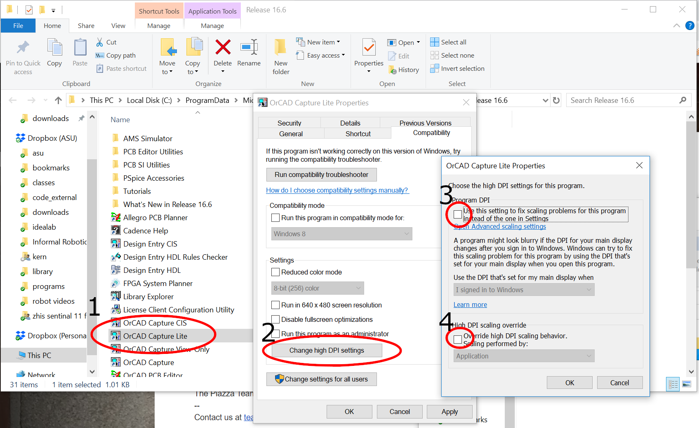

***Team Assignment***

## Objectives

To document the combined hardware design for your team's project.

### Assignment Differences by Course

| Item          | EGR304                                                    | EGR314                                                                                                           |
| ------------- | --------------------------------------------------------- | ---------------------------------------------------------------------------------------------------------------- |
| ECAD Software | You may use KiCad or Cadence to complete this assignment. | You **MUST** use Cadence to complete this assignment.                                                            |
| Fabrication   | You will be fabricating this once in Peralta              | We will be fabricating this once in Peralta (alpha prototype) and once externally ([JLCPCB](https://jlcpcb.com)) |
| Verification  | You must verify functionality on a PCB                    | You must verify functionality on a PCB                                                                           |

## Resources

* Scherz, P., & Monk, S. (2016). [Practical electronics for inventors, fourth edition.](https://www.amazon.com/Practical-Electronics-Inventors-Fourth-Scherz/dp/1259587541/ref=sr_1_1?s=books&ie=UTF8&qid=1470699914&sr=1-1&keywords=practical+electronics+for+inventors+4th+edition) New York: McGraw Hill. ISBN: 978-1259587542 (many circuit design resources)
* [Cadence posts](https://embedded-systems-design.github.io/cadence/) on the Embedded Systems Design Resources blog
* [Ordering Resources](https://www.dropbox.com/sh/0pu5curaf0s2bs8/AAC_PwZxVOF_R2ny7IMxwVjea?dl=0) folder
* [Example Schematic](https://www.dropbox.com/s/ixg2uu3bmf9254d/GameControllerV2.pdf?dl=0)
* [Bill of Materials example](https://www.dropbox.com/s/urnlk2rn0xu6hih/Bill%20of%20Materials%20Example.xlsx?dl=0)
* Canvas discussion board
* ***(314 only)*** ESP32 Overview: <https://embedded-systems-design.github.io/overview-of-the-esp32-devkit-doit-v1/>
* ***(314 only)*** OLED Screen info: <https://www.amazon.com/Songhe-0-96-inch-I2C-Raspberry/dp/B085WCRS7C/>

## Instructions

Document the hardware design of your product in *all* of the following ways. *Complete all of the steps below prior to submitting your assignment to Canvas.*

### Schematic design

Cadence drawing that includes all electronic components and connectors on your printed circuit board. The design must:

1. Be labeled with team number and name, team members, project name, and version number
1. Cover all items on the [Schematic Checklist page on the ESD blog](https://embedded-systems-design.github.io/schematic-checklist/)
1. Be a combined version of the individual schematics created in the subsystem assignment. Instead of having 4 different PCBs, merge the schematics into a single diagram. Each subsystem should be labeled with the designer's name. Your design must include the following:
    1. ***(304 only)*** A custom schematic symbol for the Cypress PSoC CY8CKIT-142/143 plug-in BLE module. You can find a pinout for the module on the manufacturer's website.
    1. ***(314 only)*** A custom schematic symbol for your team's microcontroller *IC* **(not the Curiosity Nano Board)**. You can find the pinout for the microcontroller on the manufacturer's website. See instructions in the [Creating a Custom Schematic Symbol in Cadence](https://embedded-systems-design.github.io/creating-a-custom-schematic-symbol-in-cadence/) blog entry.
    1. All necessary microcontroller support circuitry (according to the datasheet), such as
        * bypass capacitors
        * pullup resistors
        * master clear circuit (PIC)
        * in-system programming header for programming the microcontroller ***(314 only)***.
    1. ***(314 only)*** A custom schematic symbol for the ESP32 plug-in wifi module. You can find the pinout for the wifi module here: <https://embedded-systems-design.github.io/overview-of-the-esp32-devkit-doit-v1/>.  **DIP Package is approved**
    1. ***(314 only, optional)*** A custom schematic symbol for the [OLED Screen](https://www.amazon.com/Songhe-0-96-inch-I2C-Raspberry/dp/B085WCRS7C/). **DIP Package is approved**
    1. Custom schematic symbols for any other components that are not in preexisting libraries. Components can be custom-built (most common), or sometimes found in the built-in libraries or on [UltraLibrarian](https://www.ultralibrarian.com) (see the [Cadence Schematic Tutorials](https://embedded-systems-design.github.io/cadence-schematic-tutorials/) page).
    1. Connectors or headers for power and all other signals coming into and leaving the board (e.g., HEADER parts from the Connector library). This includes connectors for switches, sensors, and actuators that will not be mounted directly to your PCB.
    1. 0.1 µF non-polarized capacitors to bypass the power supply for digital ICs (see [Bypass Capacitor Basics page](https://embedded-systems-design.github.io/bypass-capacitor-basics/)).
    1. All necessary discrete components (e.g., resistors, capacitors, inductors) (see datasheets for your major components).
    1. At least one fuse and fuse receptacle for limiting the damage due to shorts.
    1. One set of pullup resistors for I$^2$C comunication wires
    1. A short text label describing each section of the circuit, in addition to a label block with your team number and name, your name, project name, and version number.
    1. 4 - 8 LEDs (and current-limiting resistors) on unused I/O pins for debugging indicators.
    1. Additional requirements listed on the [Schematic Checklist](https://embedded-systems-design.github.io/schematic-checklist/) page.

4. **Verify your schematic against these [Most Common Mistakes](https://embedded-systems-design.github.io/schematic-checklist-short/)**

### BOM: **Bill of materials**

A "shopping list" spreadsheet of **all** the parts (including headers) required to build your project. It is typically created by engineers and used by a non-technical purchasing department to buy parts.

> This step is **optional** for the initial canvas submission, but is **required for your checkpoint 2 presentation and material submission**. If you would like to receive initial feedback, please include it.

1. After completing the schematic, export a BOM from Cadence (Tools menu > Bill of Materials...) and load it into Excel or Sheets.

1. Modify the Bill of Materials spreadsheet (see example in Resources above) with the following columns:

    1. **Part Name/Description.** (e.g., "8-stage shift-and-store bus register"). Be specific.
    1. **Unit Quantity.** Quantity of each component needed in a single unit of the project
    1. **Unit Prototype Cost.** Low-volume cost per part. From manufacturer or distributor (see [Suppliers](https://embedded-systems-design.github.io/search/?s=suppliers))
    1. **Total Prototype Cost** = Unit Quantity x Unit Prototype Cost
    1. **Unit Production Cost.** High-volume (based on expected sales of the product) cost per part. From manufacturer or distributor (see [Suppliers](https://embedded-systems-design.github.io/search/?s=suppliers)).
    1. **Total Production Cost** = Unit Quantity x Unit Production Cost
    1. **Manufacturer.** What company makes the part? (see [Suppliers](https://embedded-systems-design.github.io/search/?s=suppliers))
    1. **Manufacturer Part #.** Found on the data sheet for the part
    1. **Supplier**. From where will you buy the part? This is often different than the manufacturer
    1. **Supplier Part #.** Sometimes different than manufacturer part #.
    1. **# Ordered.** Quantity of each part ordered from a supplier.
    1. **Date Ordered.** Date that each part was ordered from the supplier.
    1. **# Received.** Quantity of each part in possession by the team.
    1. **Surplus** = # Received - Unit Quantity. Make sure to order extras of each part (particularly the inexpensive parts).
    1. **Schematic Reference Designators.** (e.g., U1, R1, R3, R5) Output from ECAD software (you may not have this information yet)

    > *Note 1: Mechanical parts may not use all of the above columns* component order and arrival dates

    

    > *Note 2:* Components acquired for free from Peralta must still be sourced from a distributor with all of the information above (including prototype and production costs).

1. Label the spreadsheet with team number and name, your name, project name, and version number
1. Add any parts required for your project which have not made it into your schematic. This includes extra part counts, parts in your system which are not on your board (power supply, programmers, offboard wifi modules, other networked components, etc.)

## Submission Instructions

This work will be used in multiple ways. It will be reviewed for feedback in class on the date given in Canvas, so please be prepared to discuss it with a member of the teaching team.

### Canvas Submission

Submit the team schematic and optional BOM to Canvas by the deadline given (in Canvas). **Do not submit screenshots.** *Do not submit links to Google documents.* It is your responsibility to ensure that your submission to Canvas was successful. Late Canvas submissions will be graded per the policy in the syllabus. No credit will be awarded for assignments not submitted via Canvas.

### Schematic Files

Follow the instructions for packaging your schematic ([kicad$^1$](https://embedded-systems-design.github.io/packaging-kicad-files-for-submission/))([cadence](https://embedded-systems-design.github.io/packaging-cadence-files-for-submission/)) to create a PDF and ZIP archive (including all library files) for your project. Submit both the PDF and ZIP archive, as separate documents to this assignment on [Canvas](https://canvas.asu.edu) by the deadline in Canvas.

## Subsequent Uses of this document

### Classtime

This document should be made available during classtime for review by the teaching team on the due date. We will provide feedback, which will be your responsibility to integrate and address in subsequent submissions.

### Report

This document will also be added to your team's report and maintained throughout the semester. It will be graded for additional feedback in upcoming project checkpoints.

### Checkpoints

This document will be summarized in your checkpoint 2 presentation.

## Grading

| **Item**                                         | **Points** |
| :----------------------------------------------- | :--------- |
| Full (complete) draft schematic submitted to Canvas and brought to class | 50         |
| **Total**                                        | **50**     |

## Example Schematic

## Frequently Asked Questions

**Q:** I need help with Cadence! When are office hours?  
**A:** See Canvas for up-to-date information on office hours.

**Q:** It is difficult to create a schematic without crossing wires. Is it OK if wires cross as long as they do not connect?  
**A:** Wires can cross in a schematic, but there are best practices for making schematics look professional. See the [Keeping a Schematic Tidy](https://embedded-systems-design.github.io/keeping-a-schematic-tidy/) blog entry and/or stop by office hours.

**Q:** When pulling up libraries when first starting to create a custom schematic symbol, custom library is not coming up as an option. How do I get my custom library to come up?  
**A:** You can create a custom library folder by choosing "File > New > Library". This will create a new library with a default name under Design Resources in the project.

Once you have the custom library created, right-click on the library and choose "New Part".

**Q:** I get this error, how do I fix it?

> *Duplicate Pin Name "DRAIN" found on Package IRF520 , Q1 Pin Number 4: SCHEMATIC1, PAGE1 (4.90, 2.30). Please renumber one of these.*

**A:** Select the part, then right click on it and select "Edit Part". If you double click on each of the top two pins, you will see that they both have the name set to "DRAIN". Change the names so that they do not match. For example, "DRAIN1" and "DRAIN2":

Close the part editor tab and when it asks if you want to update the part, select "Update All" then "Yes". Save the file and try netlisting again.

**Q:** How do you increase the size of the toolbar in Cadence?  
**A:** Experiment with the compatibility settings in Windows. Right click on Orcad Capture Lite, select "Open file location". The program directory will pop up. Right click on the icon for Orcad Capture light, and select "properties"(1). Go to the compatibility tab and select "DPI settings"(2). Try playing with settings (3) and (4).

$^1$ KiCad is only permitted in EGR304
