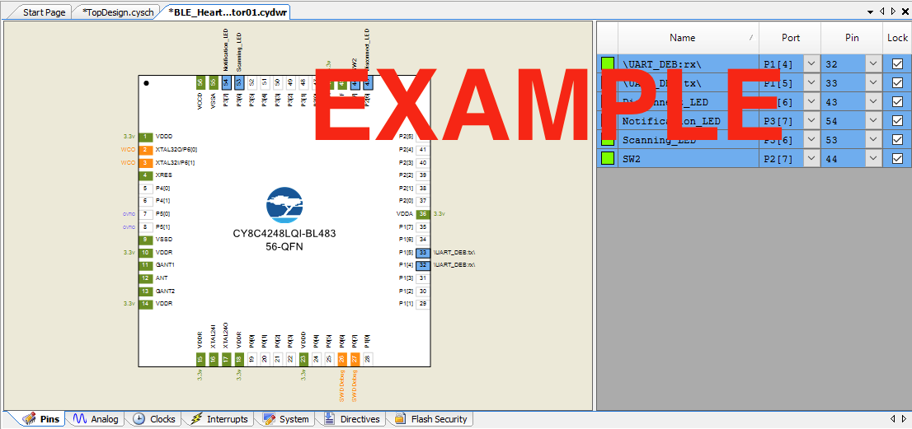
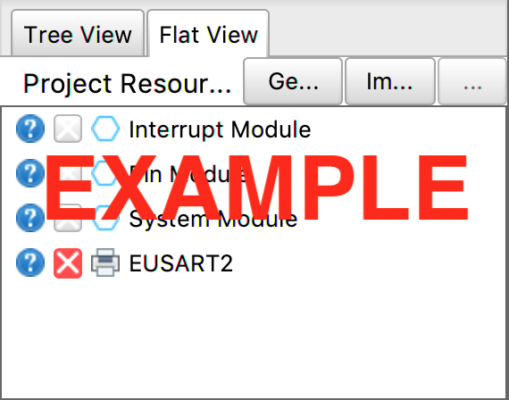

***Team Assignment***

## Objectives

In this assignment, you will create the framework for your PSoC / MPLabX project that combines together all of the parts of your team's code into a single PSoC Creator / MPLabX Project. Your team must demonstrate proficiency in:

1. Setting up PSoC Creator / MPLabX and its various components in such a way to map to your updated block diagram.

2. Transferring your Software proposal Activity Diagram or State Chart to a C-specific implementation in PSoC Creator / MPLabX.

**This is a team assignment.** You must work with your team to complete the assignment.

***Note:* Failure to complete this assignment on time could significantly impact your success in completing this project by the end of the semester.**

## Resources

Programming:

- [Overview of Functions](https://www.tutorialspoint.com/cprogramming/c_functions.htm) (Tutorialspoint)
- Wikipedia [article on pseudocode](https://en.wikipedia.org/wiki/Pseudocode)
- [Block Diagram](/3x4/3x4-team-block-diagram/) Assignment
- [Software Proposal](/3x4/3x4-team-software-proposal/) Assignment

## Instructions

1. Update your block diagram to reflect each team member's current subsystem as reflected on the team schematic. Refer to the [Block Diagram assignment](/3x4/3x4-team-block-diagram/) for full instructions, but most notably:

    - Ensure all ports and pins on the microcontroller are fully described
    - Ensure all subsystems are properly labeled within the microcontroller box
    - Ensure you have included a block for BLE, MQTT, or other external wireless interface

2. Update your software diagram to reflect any changes made since it was created. Ensure that:

    - Your diagram reflects any changes to hardware
    - Your diagram follows the UML standard
    - Your diagram implements all feedback received from the original submission and checkpoint 1 feedback
    - Blocking code is removed or can be justified. (interior ```sleep()``` functions or ```while``` loops should be avoided)

3. Create a PSoC Creator / MPLabX Workspace and project that includes

    1. A Top Design (304) / MCC (314) with blocks placed (or subsystems defined for 314) for each major function of the microcontroller.

        - Subsystems should be set up in a way that reflects the way your hardware functions
        - Wires must be placed between blocks, if required. ***(304 only)***
        - The code should compile with all blocks placed.

    2. Pins defined and matching the block diagram and team schematic.

4. Update main.c to include the following:

    1. All "functions" described in your software diagram are defined in ```main.c```, including your ```main()``` function.

        > *Note:* Our interpretation of a function in your software diagram is an activity as defined by UML activity diagrams. In other words, a block of code that contains other actions/functions.

    2. Replicate the software diagram in your code in the same sequence you describe it in your updated software diagram, to the following level of detail:

- All branching logic should be represented by if/then statements or case statements

    > Note: You may need to create some "dummy" variables to describe sensor states

- All activities (subfunctions) called by a parent activity (```main()``` function) in your *software diagram* should likewise be called in your *code.*

- Each of the lowest-level action blocks in your software diagram should be represented by commented-out pseudocode.

    > Note: Make sure your code still compiles after adding comments.

## Canvas Submission

This work will be used in multiple ways. It will be reviewed for feedback in class on the date given in Canvas, so please be prepared to discuss it with a member of the teaching team.

### Draft and Final Submission

Follow the same instructions for submitting your draft and final submissions.  **Do not submit screenshots.** *Do not submit links to Google documents, Lucidchart documents, or Visio files, etc.* It is your responsibility to ensure that your submission to [Canvas](https://canvas.asu.edu) was successful. Late Canvas submissions will be graded per the policy in the syllabus. No credit will be awarded for assignments not submitted to Canvas.

#### Block Diagram

Submit your updated block diagram in PDF format as a separate file.

#### Software Diagram

Submit your updated block diagram in PDF format as a separate file.

#### Project IDE Workspace -- PSoC Creator (304) / MPLabX (314)

1. Please submit a ```.zip``` archive of your project's full workspace

2. Please also submit a ```.pdf``` consisting of screenshots as a separate file, consisting of the following project views:

- ***EGR 304:* Screenshots of your team's PSoC Creator Top Design and Pins tab** with all of the necessary components to match your team's block diagram (see example screenshots in Appendix):

    1. ```TopDesign.cysch``` (screenshot), showing your team number, project name, and the key modules necessary for your project added.

    2. Pins tab (screenshot) in the ```.cydwr``` file, showing all I/O pins and the checkboxes correctly mapped to pins on the PSoC.

- ***EGR 314:* Screenshots of your team's MPLabX project** with the following sections configured in MPLAB Code Configurator (MCC) (see example screenshots in Appendix) to match your team's block diagram:

    1. Project Resources - Flat View selected (screenshot), showing the key modules necessary for your project added. See example, Figure 1 below.

    2. Pin Module (screenshot), showing all I/O pins and the checkboxes correctly configured as inputs, outputs, analog, and/or digital pins. See
    example, Figure 2 below.

## Grading

| **Item**                                                                               | **Points** |
| -------------------------------------------------------------------------------------- | ---------- |
| Full draft submitted to Canvas and brought to class for in-class feedback and checkoff | 50         |
| Updated Block Diagram                                                                  | 25         |
| Updated Software Diagram                                                               | 25         |
| Fully Implemented PSoC Creator / MPLabX Workspace  (*-20 points for each mistake*) | 200        |
| **Total**                                                                              | **300**    |

## Appendix: Example Screenshots


*Figure 1: PSoC Creator Top Design screenshot example*


*Figure 2: PSoC Creator Pins Tab screenshot example*


*Figure 3: MPLabX MCC Configured Project Resources - Flat View screenshot example*


*Figure 4: MPLabX MCC Configured Pin Module screenshot example*
