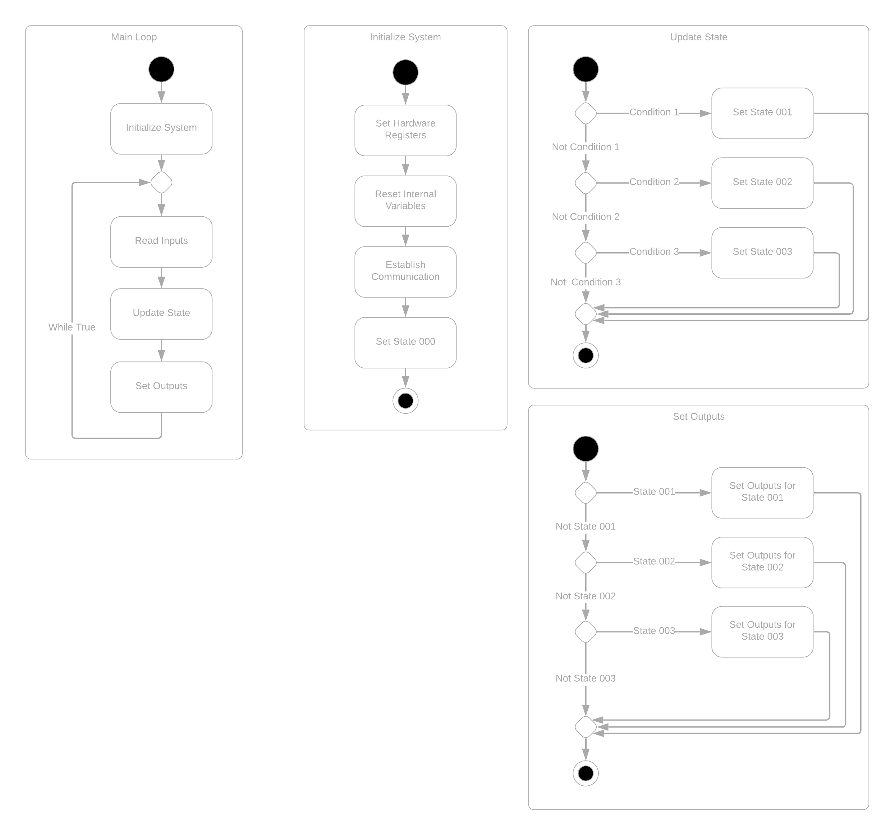
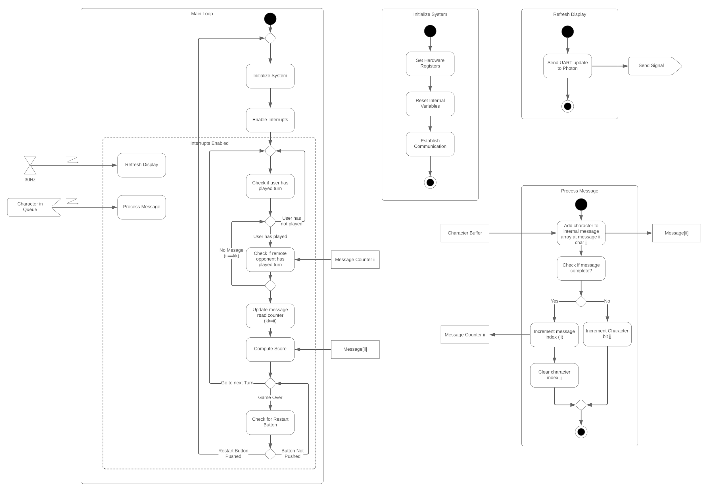

***Team Assignment***

[Video Walkthrough of Assignment](https://youtu.be/ln3IauA7Utg)

## Objectives

To document the software design for the microcontroller in your product. It is common practice in industry to document the logical flow of software prior to handling implementation-level details like coding. These diagrams make writing code much easier, as well as help to improve the quality of your software design.

## Resources

* [draw.io](https://www.draw.io/) package (compatible with Google Drive)
* [Software Design](https://embedded-systems-design.github.io/software-design/) page on the Embedded Systems Design Resources blog
* Tutorials
    * [UML Activity Diagram Tutorial](http://www.sparxsystems.com.au/resources/uml2_tutorial/uml2_activitydiagram.html)
    * [UML State Machine Diagram Tutorial](https://sparxsystems.com/resources/tutorials/uml2/state-diagram.html)
    * [UML 2.5.1 Specification](https://www.dropbox.com/s/rfoy6kx59nhxx7e/UML%20Spec.pdf?dl=0)
* Examples
    * *(EGR304):* [Simple Activity Diagram Example](https://www.dropbox.com/s/qbphzio2o5mcemx/Simple%20Activity%20Diagram%20Example.pdf?dl=0)
    * *(EGR314):* [Activity Diagram with Interrupts](https://www.dropbox.com/s/70hfczjdyusv595/Activity%20Diagram%20Example.pdf?dl=0)
    * Example Gameplay Activity Diagram with Interrupts [(pdf)](https://www.dropbox.com/s/70hfczjdyusv595/Activity%20Diagram%20Example.pdf?dl=0)
    * [State Machine with Interrupt Example](https://www.dropbox.com/s/1npw6b2gs0il92r/Water%20Heater%20State%20Chart.drawio?dl=0) from TC
    * [Uml-diagrams.org](https://www.uml-diagrams.org/activity-diagrams-examples.html) Activity Diagrams example
* C Programming
    * [Simple State Machines in C / C++](https://www.codeproject.com/Articles/1275479/State-Machine-Design-in-C)
    * Nice [discussion](https://stackoverflow.com/questions/1371460/state-machines-tutorials) of State Machine Tutorials on Stack Overflow
* Canvas Discussion Board

|                                                                       304                                                                        |                                                                       314                                                                        |
| :----------------------------------------------------------------------------------------------------------------------------------------------: | :----------------------------------------------------------------------------------------------------------------------------------------------: |
|                                                                                                                                   |                                                                                                                                   |
| *Figure 1a:* Simple Activity Diagram Example ([pdf](https://www.dropbox.com/s/qbphzio2o5mcemx/Simple%20Activity%20Diagram%20Example.pdf?dl=0)) | *Figure 1b:* Example Activity Diagram with Interrupts ([pdf](https://www.dropbox.com/s/70hfczjdyusv595/Activity%20Diagram%20Example.pdf?dl=0)) |

## Assignment

1. Create a Unified Modeling Language (UML) Activity Diagram or [State Machine Diagram](https://en.wikipedia.org/wiki/State_diagram) to document the *logical behavior* of the software for the microcontroller in your project. Documenting behavior does not require that you have written any code. It is about ignoring coding syntax and writing logically how the code (once written) will function. Software for creating Activity Diagrams and State Machine Diagrams can be found on the [Software Design page on the ESD blog](https://embedded-systems-design.github.io/software-design/). Read [State Machine Diagram vs. Activity Diagram](https://www.visual-paradigm.com/guide/uml-unified-modeling-language/state-machine-diagram-vs-activity-diagram/) from Visual Paradigm to help you decide which type of diagram makes the most sense for your project. If no one diagram suits the whole project, you may need to use both.

    Diagrams should:

    * Accurately represent the proposed software design *(most important)*
    * Use correct shapes and symbols throughout the diagram
    * ***(EGR 314 only)*** Avoid blocking code (nested while loops or sleep/pause/wait blocks) via the use of interrupts and/or state machines
    * Use arrows to connect boxes
    * Have appropriately-labeled arrows
    * ***(EGR 314 only)*** Accurately depict all interrupts used in the program (see example)
    * Capture activities at an appropriate level of granularity. For example, do not simply add a block for user input. Instead, document all of the steps involved with getting input from the user
    * User input can be in its own diagram and referenced by a higher level diagram (e.g., the process message and refresh delay subdiagrams in Figure 1).
    * ***(EGR 314 only)*** **Include at least one interrupt (required in project description). No interrupts are required for EGR 304 projects.**
    * **Include implementation of communications protocols among devices**

## Submission Instructions

This work will be used in multiple ways. It will be reviewed for feedback in class on the date given in Canvas, so please be prepared to discuss it with a member of the teaching team.

### Canvas Submission

Submit your completed report in Office or PDF format to this assignment on Canvas by the deadline in Canvas. *Do not submit links to Google or Visio documents.* It is your responsibility to ensure that your submission to Canvas was successful. Late Canvas submissions will be graded per the policy in the syllabus. No credit will be awarded for assignments not submitted to Canvas.

## Subsequent Uses of this document

### Classtime

This document should be made available during classtime for review by the teaching team on the due date. We will provide feedback, which will be your responsibility to integrate and address in subsequent submissions.

### Report

This document will also be added to your team's report and maintained throughout the semester. It will be graded for additional feedback in upcoming project checkpoints.

### Checkpoints

This document will be summarized in your checkpoint 2 presentation.

## Grading

As described above in Assignment description

| **Item**                                                       | **Points** |
| -------------------------------------------------------------- | ---------- |
| Full (complete) draft submitted to Canvas and brought to class | 50         |
| **Total**                                                      | **50**     |

## Most Common Mistakes

* Most embedded systems should always continue running unless the power is turned off. Therefore, if an activity diagram has boxes with an arrow in but no arrow out, this might indicate a logic error where the program could stop. Even if a product has one primary purpose, it should be able to start over and execute its purpose again without cycling the power.

* ***(EGR 314 only)*** Make sure to document interrupt service routines correctly in your diagram.

## Frequently Asked Questions

**Q:** If each team member's implementation of the team design relies upon different software, do we need separate software design diagrams for each implementation?  
**A:** Yes. However, you may still work on these together as a team. Make sure to clearly label each diagram and annotate it with an explanation of why there are multiple diagrams for the same project.

**Q:** How is this different from a user story or user experience diagram?  
**A:** While this is supposed to capture user interactions with the system, the diagram is from the perspective of the microprocessor. Thus, user inputs may drive the behavior of the system, but the diagram should capture what the software will do in response to the various possible inputs from the user at any given state or stage of the flow.

**Q:** Should my program end after the product has been used once?  
**A:** Typically, no. Most products will have a loop from near the end of the software design back to somewhere near the beginning so that the product can be used continuously.

**Q:** If I have two microcontrollers in my design, do I need a separate diagram for each one?  
**A:** Yes
