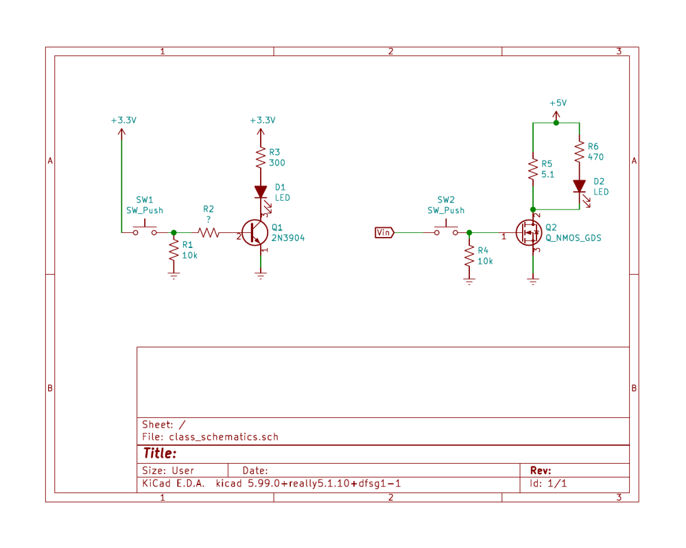

***Individual Assignment***

## Objectives

The goal for this lab is to learn how to use transistors as switches for the purposes of driving high-current actuators and other "outputs". You will gain practice at designing basic switching circuits using metal oxide silicone field effect transistors (MOSFETs).

**An individual live demonstration of Part 3 of this assignment is required.**

## Parts Needed

| **Item**                                                                                                                                                                                                                       | **Quantity** |
|:-------------------------------------------------------------------------------------------------------------------------------------------------------------------------------------------------------------------------------|:-------------|
| 5V Power Supply from In-Class Checkoff #1                                                                                                                                                                                     | 1            |
| 2N3904-AP NPN BJT ([digikey](https://www.digikey.com/product-detail/en/micro-commercial-co/2N3904-AP/2N3904-APCT-ND/950591)) ([datasheet](https://www.mccsemi.com/pdf/Products/2N3904(TO-92).pdf))                         | 1            |
| AOTF2618L MOSFET ([digikey](https://www.digikey.com/product-detail/en/alpha-omega-semiconductor-inc/AOTF2618L/785-1442-5-ND/3603382)) ([datasheet](http://aosmd.com/res/data_sheets/AOTF2618L.pdf))                        | 1            |
| FAN8100N H-Bridge ([digikey](https://www.digikey.com/en/products/detail/fairchild-semiconductor/FAN8100N/11558200)) ([datasheet](https://rocelec.widen.net/view/pdf/1pizbjqffm/FAIRS23777-1.pdf?t.download=true&u=5oefqw)) | 1            |
| Mini Motor [mpja](https://www.mpja.com/3VDC-Mini-Motor/productinfo/34668+MD/)                                                                                                                                                | 1            |
| 5.1$Omega$ Resistor                                                                                                                                                                                                           | 1            |
| 1/4 Watt Resistors                                                                                                                                                                                                             | various      |
| LEDs                                                                                                                                                                                                                           | 2            |
| Benchtop Power Supply                                                                                                                                                                                                          | 1            |
| Benchtop Power Multimeter                                                                                                                                                                                                      | 1            |

## Resources

-   Scherz & Monk

    -   Section 4.3: Transistors

        -   4.3.1 - Introduction

        -   4.3.4 - MOSFETs

    -   [BK Precision Triple-Output 30V, 5A Digital Display DC Power Supply (Model 1671)](https://www.bkprecision.com/products/power-supplies/1671A-triple-output-30v-5a-digital-display-dc-power-supply.html) ([manual](https://bkpmedia.s3.amazonaws.com/downloads/manuals/en-us/1671A_manual.pdf))

    -   [Agilent Digital Multimeter (Model 34461A)](https://www.keysight.com/us/en/support/34461A/digital-multimeter-6-5-digit-truevolt-dmm.html) ([manual](https://www.dropbox.com/s/futmq59a8ftekqs/Agilent_DMM_34461A.pdf?dl=0))

-   Canvas Discussion Board

-   The [Embedded Systems* *Design Website](https://embedded-systems-design.github.io)

-   Websites

    -   [https://www.electronics-tutorials.ws/transistor/tran_7.html](https://www.electronics-tutorials.ws/transistor/tran_7.html)

## Part 1: Prior to Demonstration of Proficiency

1.  Go through the resources indicated above.

## Part 2: Prior to Demonstration of Proficiency

*The purpose of this step is to design a NPN BJT circuit to drive a low-current device (a LED). Despite the low current requirements, external transistors are often necessary when used with microcontrollers in order to supply currents larger than ~20mA. BJT's are ideal for these low-power, high-speed switching applications, and work better than most MOSFETs in the case of 3.3V logic levels as the base-emitter saturation voltage (voltage to turn it on) is low (0.6-0.85V). But these are current-controlled devices, and so selecting the proper current limiting values (in the form of resistance) is critical.*

***Note:** You should use the 3.3V power supply circuit you demonstrated in class for this assignment*

1.  Design a circuit on your breadboard using your ***2N3904*** transistor that can light up a LED from a low-power digital microcontroller pin.

 

1.  

2.  *Figure 1: Schematic of circuits used in step 1*

    1. Find the worst-case $V_{text{CE}}$ for the ***2N3904*** from the datasheet.

    -   *In this case the worst-case value is the maximum, because if the transistor's* $V_{text{CE}}$ *is actually lower, the transistor will be heating less and able to deliver more current to the load.*

    1. Determine $I_{R_{3}}$ (the current across $R_{3}$ ) given the resistance of $R_{3}$ and the voltage of the power supply feeding $R_{3}$, and $V_{text{CE}}$.

    1. Find the maximum continuous collector current ($I_{C}$) for the ***2N3904*** from the datasheet. ($I_{C} = I_{R_{3}}$ in this circuit)

    -   ***Check:** Is the load's current lower than the maximum rated current?*

    1. Look in Section 4.3.2 of the textbook. What is the "fundamental formula", used to describe the behavior of a bipolar transistor?

    1. Find the worst-case gain ($h_{text{fe}}$) for the ***2N3904*** from the datasheet.

    -   *In this case the worst-case value is the minimum, because if the transistor's* $h_{text{fe}}$ *is actually higher, the transistor will still be in saturation and able to deliver current to the load.*

    1. From that expression, determine $I_{B}$ (the current across $R_{2}$).

    1. Find the $V_{BE(sat)}$ of the ***2N3904*** from the datasheet. Since there is a range, use the worst case value.

    -   *In this case the worst-case value is the maximum, because if the transistor's* $V_{text{BE}}$ *is actually lower, the device will still turn on.*

    1. Assuming $R_{1} > > R_{2}$, you can assume that the voltage coming into $R_{1}$ is ~3.3V. Using the worst-case $V_{text{BE}}$ to determine $V_{R_{2}}$, the voltage drop across $R_{2}$.

    1. Given $I_{B}$ and $V_{R_{2}}$, Find the ideal value for $R_{2}$.

    -   *Since you don't have access to resistors of any value, should you use a lower or higher value when designing a practical circuit?*

    1. Construct this circuit on your breadboard and demonstrate its operation. Confirm the current at the same points with your multimeter.

    1. The Value of $R_{3}$ was selected to ensure that when on, no more than 20mA would flow through the LED. Confirm the current flowing through the base and collector of the transistor.

 

2.  

3.  -   

## Part 3. Individual Demonstration of Proficiency

Please be prepared to demonstrate:

1.  Working circuit from step 1 delivering <20mA across the LED

2.  Working circuit from step 2 delivering ~1A across the 5 Ohm power resistor

3.  Working circuit from step 3, showing the motor being driven in forward and reverse.

## Canvas Submission

No Canvas submission is necessary. Complete your demonstrations by the deadline in the course calendar on [Canvas](https://canvas.asu.edu/). Late demonstrations will be graded per the policy in the syllabus.

## Grading

| **Item**                | **Points** |
|:------------------------|:-----------|
| Part 3. Demonstration 1 | 100        |
| Part 3. Demonstration 2 | 100        |
| Part 3. Demonstration 3 | 100        |
| **Total**               | **300**    |
