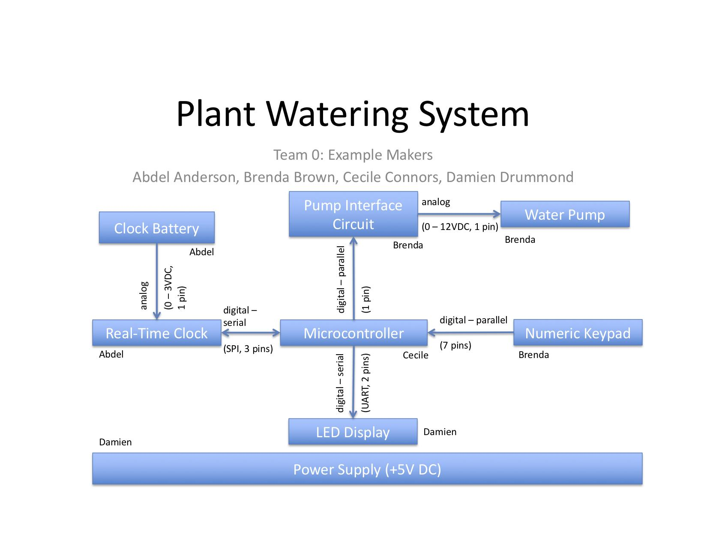
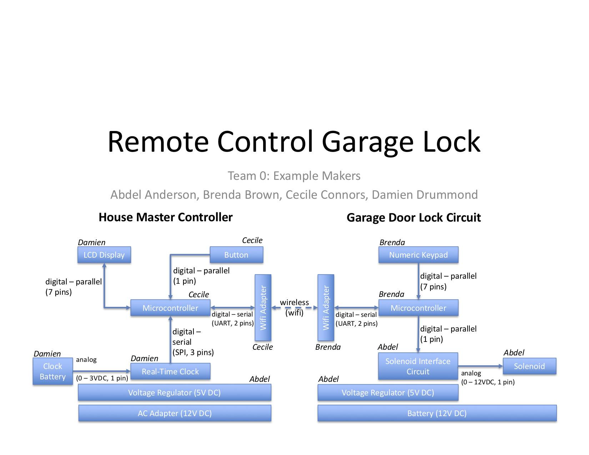

***Hardware Architecture***

## Objectives

To define the electrical and electromechanical systems architecture for your project, and define team member roles.

## Resources

-   [Drawing Software](http://esdresources.blogspot.com/2016/01/drawing-software.html) on the Embedded Systems Design blog

-   Canvas Discussion Board

## Assignment

Create a hardware architecture diagram for your team's project with the following parts:

1.  **Team number, team members, project name**

2.  **Blocks for each major electrical subsystem/component**
    > *There must be at least 1 subsystem per teammate*

3.  **Lines connecting the blocks**. Include arrows indicating the direction of signal flow, text labeling the signal type, and the number of signal pins. This information is important for determining how many pins and what peripherals (e.g., ADC, SPI) you need on a microcontroller. See Table 1 on page 2 for examples of common power and signal labels.

4.  **Annotations of which individual team member will be responsible for each block**. Each team member must be responsible for at least 1 acceptable subsystem (see Project Description) in the project.

5.  Other information you feel is relevant to help describe the electrical architecture of your project.

*Table 1:* Common power and signal types and labels (click the links to learn more)

+---------------------------------------------------------------------------------+---------------------------------------------------------------------------+-------------------------------------------------------------------------------------------------------------------------------------------+----------------------------------------------------------------------------------------------------------+
| **Type**                                                                        | **Label**                                                                 | **Label Examples**                                                                                                                        | **Typical Uses**                                                                                         |
+=================================================================================+===========================================================================+===========================================================================================================================================+==========================================================================================================+
| [Analog](https://learn.sparkfun.com/tutorials/analog-vs-digital)                | Analog (*Minimum Voltage - Maximum Voltage*, *Number of Signal Pins*[^1]) | Analog (0 - 3VDC, 1 pin)                                                                                                                  | Analog output sensors, actuators that require an interface block to connect to a microcontroller, opamps |
+---------------------------------------------------------------------------------+---------------------------------------------------------------------------+-------------------------------------------------------------------------------------------------------------------------------------------+----------------------------------------------------------------------------------------------------------+
|                                                                                 |                                                                           | Analog (0 - 5VDC [PWM](https://learn.sparkfun.com/tutorials/pulse-width-modulation), 1 pin)                                               |                                                                                                          |
+---------------------------------------------------------------------------------+---------------------------------------------------------------------------+-------------------------------------------------------------------------------------------------------------------------------------------+----------------------------------------------------------------------------------------------------------+
|                                                                                 |                                                                           | Analog (120VAC, 2 pins)                                                                                                                   |                                                                                                          |
+---------------------------------------------------------------------------------+---------------------------------------------------------------------------+-------------------------------------------------------------------------------------------------------------------------------------------+----------------------------------------------------------------------------------------------------------+
| [Digital - Parallel](https://learn.sparkfun.com/tutorials/serial-communication) | Digital - Parallel (*Number of Signal Pins*)                              | Digital - Parallel (8 pins)                                                                                                               | Buttons, keypads, parallel LCD screens, H-bridge control pins (may also be Analog PWM)                   |
+---------------------------------------------------------------------------------+---------------------------------------------------------------------------+-------------------------------------------------------------------------------------------------------------------------------------------+----------------------------------------------------------------------------------------------------------+
| [Digital - Serial](https://learn.sparkfun.com/tutorials/serial-communication)   | Digital - Serial (*Protocol*[^2], *Number of Signal Pins*)                | Digital - Serial ([I$^{\text{2}}$C](https://learn.sparkfun.com/tutorials/i2c?_ga=2.97189791.1677078136.1578610125-1273879729.1578610125), 2 pins) | Accelerometers, addressable LED strips, digital temperature sensors, serial LCD screens                  |
+---------------------------------------------------------------------------------+---------------------------------------------------------------------------+-------------------------------------------------------------------------------------------------------------------------------------------+----------------------------------------------------------------------------------------------------------+
|                                                                                 |                                                                           | Digital - Serial ([UART](http://www.circuitbasics.com/basics-uart-communication/), 2 pins)                                              |                                                                                                          |
+---------------------------------------------------------------------------------+---------------------------------------------------------------------------+-------------------------------------------------------------------------------------------------------------------------------------------+----------------------------------------------------------------------------------------------------------+
| Power                                                                           | Power (*Voltage*)                                                         | Power (+12V DC)                                                                                                                           | Used for power supply blocks only (not on lines)                                                         |
+---------------------------------------------------------------------------------+---------------------------------------------------------------------------+-------------------------------------------------------------------------------------------------------------------------------------------+----------------------------------------------------------------------------------------------------------+
| Wireless                                                                        | Wireless (Protocol)                                                       | Wireless (Bluetooth Low Energy)                                                                                                           | Bluetooth, WiFi, RF                                                                                      |
|                                                                                 |                                                                           |                                                                                                                                           |                                                                                                          |
|                                                                                 | *(show with a dashed line)*                                               |                                                                                                                                           |                                                                                                          |
+---------------------------------------------------------------------------------+---------------------------------------------------------------------------+-------------------------------------------------------------------------------------------------------------------------------------------+----------------------------------------------------------------------------------------------------------+

Sensors and actuators will communicate with the microcontroller using either analog and/or digital signals. For each signal (analog or digital), you must list the number of *signal* pins that will go between the sensor/actuator and microcontroller, **not including power or ground pins**. This is to ensure that you correctly calculate the number of pins that you need on a microcontroller.

**Example.** Consider a sensor with a 5-pin connector and a bidirectional [SPI interface](https://learn.sparkfun.com/tutorials/serial-peripheral-interface-spi). Three of the pins are for SPI communications (MOSI, MISO, and SCK) and two of the pins are for power and ground to the sensor. In the block diagram, the line connecting the sensor and microcontroller should have arrows on both ends (bidirectional), and 3 pins should be listed on the block diagram because this is the number of pins that must be reserved on the microcontroller.

**We highly recommended that you closely follow the Example block diagrams on page 4 and review the Common Mistakes section below before completing the assignment.**

## Grading

| **Item**                                                                                       | **Points** |
|:-----------------------------------------------------------------------------------------------|:-----------|
| Draft                                                                                          | 50         |
| 1. Team information                                                                           | 25         |
| 2. Blocks                                                                                     | 50         |
| 3. Lines                                                                                      | 50         |
| 4. Annotations                                                                                | 25         |
| Each mistake (up to the maximums for each section listed above in the Assignment description.) | -5         |
| **Total**                                                                                      | **200**    |

## Submission

Submit your completed block diagram in Office or PDF format to this assignment on [Canvas](https://canvas.asu.edu) by the deadline in the course calendar on [Canvas](https://canvas.asu.edu). *Do not submit links to Google documents, Lucidchart documents, or Visio files.* It is your responsibility to ensure that your submission to Canvas was successful. Late Canvas submissions will be graded per the policy in the syllabus. No credit will be awarded for assignments not submitted to Canvas.

## Examples

*Figure 1: Example block diagram for plant watering system*

*Figure 2: Example block diagram for remote control garage lock*

## Frequently Asked Questions

**Q: How many subsystems are we supposed to have?**

**A:** Each student will be responsible for one acceptable subsystem (see the Project Description). Embedded code does not count as a subsystem by itself. Upcoming homework assignments will require each student to design their own separate subsystem, and eventually integrate subsystems within each team. This is discussed in more detail in the Syllabus and in the Project Description on [Canvas](https://canvas.asu.edu).

**Q: Can multiple team members be assigned to a single block?**

**A:** No. One team member needs to be responsible for each block, but other team members can help (as long as they are also responsible for at least one subsystem of their own).

**Q: Does a phone count as a sensor, actuator, or subsystem?**

**A:** No. You must have at least one sensor and one actuator directly connected to the microcontroller. While you can create a phone app as part of your system, it does not count as a subsystem. Phones (and associated apps) should still be shown on the block diagram, connected to the microcontroller via a dashed line.

**Q:** **How should the microcontroller and wifi subsystems be scoped?**

**A:** Each is a separate subsystem. The scope of the microcontroller subsystem should include all of the support circuitry for the microcontroller (e.g., bypass capacitors, oscillators, external pullup resistors, in-system programming header and circuitry) along with writing code to start the microcontroller and bringing code to support each subsystem together into the final project. The scope of the wifi subsystem should include the headers and bypass capacitors required to connect the Particle on your board along with writing all code for the Particle and writing the PIC UART code to communicate with the Particle.

## Most Common Mistakes

Make sure:

-   The power supply block extends under all components that it is powering (see example, Figure 1)

-   There are no lines between the power supply and other blocks in the diagram

-   Sensors and actuators that need signal conditioning have separate signal conditioning block

-   Actuators that require more than the microcontroller supply voltage (typically 5V or less) are not connected directly to a microcontroller

-   Every sensor and actuator is in a separate block (even if there are multiples)

-   That all words are spelled correctly in the diagram

-   Lines to sensors point toward the microcontroller

-   Lines to actuators point away from the microcontroller

-   Pin counts only represent *signal* pins, not power and ground

-   All lines between blocks have a signal type, voltage, and pin count

[^1]: Signal pins transmit and receive data, e.g., to and from a microcontroller. Power and ground pins should not be counted because they connect to a power supply rather than input/output pins (I/O) on a microcontroller.

[^2]: The most common serial protocols are [I$^{\text{2}}$C](https://learn.sparkfun.com/tutorials/i2c?_ga=2.97189791.1677078136.1578610125-1273879729.1578610125), [SPI](https://learn.sparkfun.com/tutorials/serial-peripheral-interface-spi/all), [UART](http://www.circuitbasics.com/basics-uart-communication/), [TWI](https://www.i2c-bus.org/twi-bus/), [CAN](https://www.allaboutcircuits.com/technical-articles/introduction-to-can-controller-area-network/)
