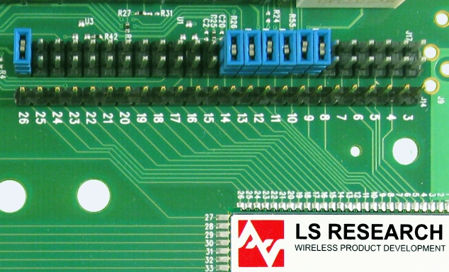

***Team Assignment***

## Objectives

In this assignment, your team will create a **single PCB layout** that combines together all of the parts of your system into a single[^1] PCB. Your team must demonstrate proficiency in:

1.  Using Cadence printed circuit board (PCB) layout software to create a custom PCB layout

2.  Creating a custom PCB design and manufacturing it using an [LPKF ProtoMat S63 Printed Circuit Board Mill](http://www.lpkf.com/products/rapid-pcb-prototyping/circuit-board-plotter/protomat-s63.htm)

***Note:* Failure to submit this assignment on time could significantly impact your success in completing this project by the end of the semester.**

## Resources

-   [Cadence posts](http://esdresources.blogspot.com/search/label/Cadence) on the Embedded Systems Design Resources blog

-   [ASU PCB Fabrication Process](http://esdresources.blogspot.com/2017/09/asu-pcb-fabrication-process.html) on the Embedded Systems Design Resources Blog

-   [Peralta PCB Mill Specs](https://peraltastudios.engineering.asu.edu/pcb-mill-specs/)

-   [Canvas](http://canvas.asu.edu) discussion board

-   Book: [Complete PCB Design Using OrCAD Capture and PCB Editor](http://search.ebscohost.com.ezproxy1.lib.asu.edu/login.aspx?direct=true&db=nlebk&AN=249296&site=ehost-live&ebv=EB&ppid=pp_iii)

## Instructions

*Complete all of the steps below prior to submitting your assignment to Canvas.*

1.  **Transfer Schematic to PCB Editor.** Follow the instructions on [Transferring a Cadence Schematic to PCB Editor](http://esdresources.blogspot.com/2015/09/transferring-cadence-schematic-to-pcb.html).

2.  Configure AutoSave in the PCB Editor the Configuring Cadence tutorials ([standalone](https://embedded-systems-design.github.io/configuring-cadence/) / [cloud](https://embedded-systems-design.github.io/configuring-cadence-cloud/) instructions).

3.  **Create a PCB Layout** for your subsystem(s)/section(s) of the project. See the [Getting Started with Cadence PCB Editor](http://esdresources.blogspot.com/2017/02/designing-pcb-with-cadence-pcb-editor.html) blog entry for more information on how to use Cadence PCB Editor.

-   *Pro tip:* Copper power and ground planes shield electromagnetic waves. Make sure the antenna of your wireless module does not have copper underneath it, either by "rubbing out" the copper or by positioning the antenna to hang off the edge of the PCB.

4.  **Verify and Fabricate.** Follow the instructions on the [ASU PCB Fabrication Process](http://esdresources.blogspot.com/2017/09/asu-pcb-fabrication-process.html) page to verify and submit your design for fabrication.

> *Note 1: You **must** show your design and DFM Now results to a TA or the professor for electronic signoff in order for your PCB to be manufactured.
> *
> *Note 2: Submitting your design to Canvas **does** **not** automatically submit it for manufacturing, or vice-versa.*

## Canvas Submission

Follow the [Packaging a Cadence PCB Project for Submission to Canvas](http://esdresources.blogspot.com/2017/09/packaging-cadence-files-for-submission.html) instructions to create a JPG/PDF and ZIP archive of your project. Submit **both** the JPG/PDF and ZIP archive to this assignment on Canvas by the deadline in Canvas. *Do not submit links to Google documents.* It is your responsibility to ensure that your submission to Canvas was successful. Late Canvas submissions will be graded per the policy in the syllabus. No credit will be awarded for assignments not submitted to Canvas.

## Grading

| **Item**                                                                                                                       | **Points** |
|:-------------------------------------------------------------------------------------------------------------------------------|:-----------|
| 1. Full draft stored on your team's Google Drive **and** PDF brought to class on the due date noted in the calendar on Canvas | 50         |
| 2. Completed Cadence (1) schematic, and (2) PCB design project files included in Canvas submission                            | 50         |
| 3. PDF or JPG capture of completed (1) schematic, and (2) PCB design included in Canvas submission                            | 100        |
| 4. PCB successfully verified by Sheldon and in queue for manufacturing by the due date noted in the calendar on Canvas        | 100        |
| **Total**                                                                                                                      | **300**    |

*Note: The PRLTA 109 staff maintains a list of successfully managed PCBs that will be used for grading. You **do not** need to "demonstrate" your manufactured PCB in order to receive credit for manufacturing.*

## Frequently Asked Questions

**Q:** I need help! When are your office hours?

**A:** See [Canvas](http://canvas.asu.edu) for up-to-date information on office hours.

**Q:** Can I connect subsystems together with jumper wires to make design and debugging easier?

**A:** No, connecting your subsystems together with jumper wires on the same PCB is not permitted. However, adding test points and jumpers (not jumper wires) to your design for debug access is good design practice. For example, the photo below shows blue jumpers being used to allow for disconnecting subsystems for testing.

Additionally, using wires to connect to offboard sensors and actuators is encouraged. We strongly recommend using screw terminals or crimp connectors for this purpose.

**Q:** I can't find the [PIC16F18446 Curiosity Nano evaluation kit](https://www.microchip.com/developmenttools/ProductDetails/DM164144) in the Cadence libraries. Do I have to make it by hand?

**A:** Yes. You will attach male-to-male headers to the evaluation kit so that you can plug it into a breadboard, and male-to-female headers on your custom PCBs so you can plug the evaluation kit into them. You can use the [Package Symbol Wizard in Cadence](http://esdresources.blogspot.com/2015/09/creating-pcb-footprint-using-package.html) to create the evaluation kit footprint (ignore the fact that the pins are not in a perfectly straight line).

**Q:** Where do I find the pinout for the 8-pin SIL connector on the MPLAB SNAP?

**A:** The pinout is not listed in the MPLAB SNAP datasheet, but is down in Figure B-2 and section B.4.2 in the [MPLAB PICkit 4 In-Circuit Debugger User's Guide](http://ww1.microchip.com/downloads/en/DeviceDoc/PICkit4%20In-Circuit%20DebuggerUG-DS50002751B.pdf).

**(EGR 304 Only)**

**Q:** I can't find the PSoC BLE module in the Cadence libraries. Do I have to make it by hand?

**A:** You are using the [PSoC 4 Bluetooth Low Energy (BLE) Module](http://www.cypress.com/documentation/development-kitsboards/cy8ckit-142-psoc-4-ble-module) for your projects. These are printed circuit boards that already have a PSoC 4 microcontroller soldered to them and a Bluetooth antenna built in. Therefore, you need to connect to the board with board-to-board connectors (e.g., male header pins) that connect to the headers on the board. Instructions on how to create a PSoC 4 BLE module in Cadence are available [here](http://esdresources.blogspot.com/2017/09/cadence-walkthrough-psoc-4-ble-module.html).

**(EGR 304 Only)**

**Q:** How do I correctly attach the PSoC to my PCB?

**A:** Students should create a footprint for the PSoC then solder on 2-row male-to-male headers (available in Peralta 109 lab). Only the plug-in module should be attached, not the entire development board. Please see the pictures below for clarification.

[^1]: Exceptions allowed with prior approval from your professor
